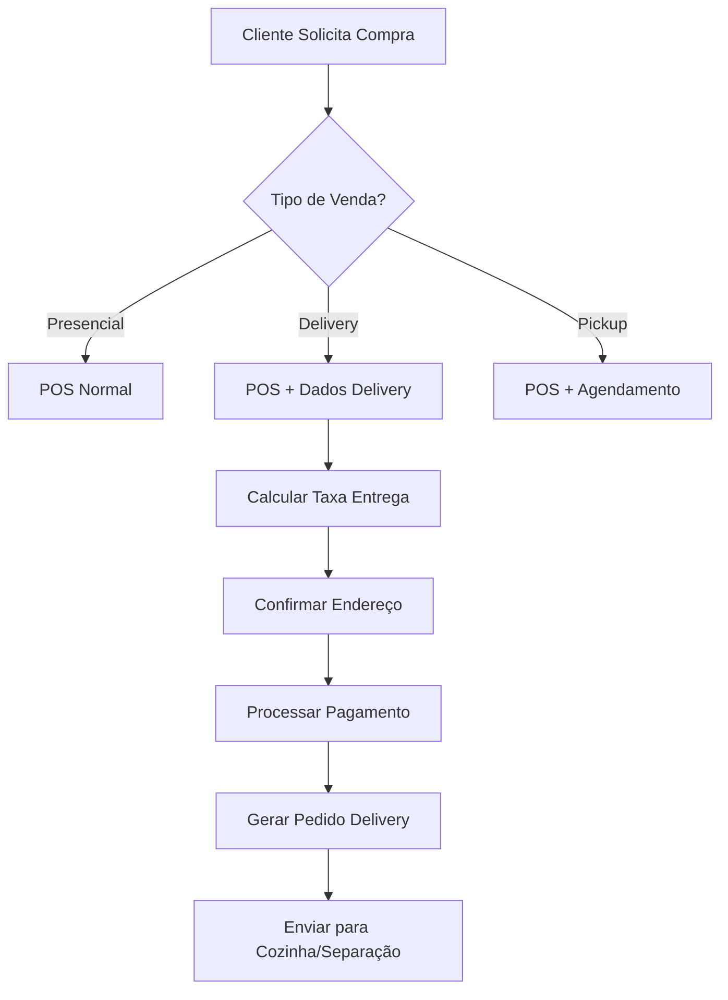
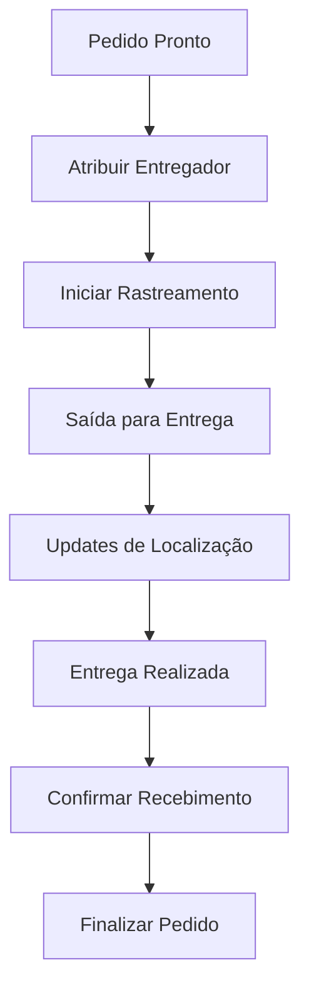

# 🚚 Delivery Sales Tracking - Análise e Implementação
## Brainstorm Completo para Sistema de Rastreamento de Vendas de Entrega

---

## 📋 Resumo Executivo

**Objetivo**: Analisar a melhor abordagem para implementar rastreamento detalhado de vendas de delivery, considerando relatórios completos, peculiaridades operacionais e integração com o sistema existente.

**Conclusão Antecipada**: Recomenda-se **integração estendida** do sistema POS existente ao invés de página separada, mantendo a página atual de "Controle de Entregas" como centro de operações logísticas.

---

## 🎯 Contexto Atual do Sistema

### Status Quo - Componentes Existentes
```typescript
// Sistema atual fragmentado:
├── 📦 Sales.tsx (POS) - Vendas gerais sem foco em delivery
├── 🚚 Delivery.tsx - Controle básico com dados mock
├── 📊 Dashboard - Métricas gerais sem breakdown de delivery
└── 📈 Reports - Relatórios sem segmentação por tipo de venda
```

### Análise da Estrutura Atual (Delivery.tsx)
**Pontos Fortes:**
- Interface moderna com glassmorphism e animações
- Estrutura de status bem definida (pendente → em_transito → entregue)
- Sistema de busca e filtragem implementado
- Cards de métricas estatísticas

**Limitações Identificadas:**
- **Dados mockados** - 3 entregas hardcoded (lines 14-18)
- **Sem integração com vendas** - Não conecta com tabela `sales`
- **Funcionalidade limitada** - Apenas mudança de status
- **Sem métricas financeiras** - Falta valores e margem
- **Sem rastreamento de tempo** - Ausência de KPIs temporais

---

## 🔍 Análise das Abordagens Possíveis

### Opção A: Página Separada para Delivery Sales ❌
**Proposta Original do Usuário**
```
Nova página: /delivery-sales
- Sistema POS dedicado para delivery
- Fluxo de venda específico
- Relatórios próprios
```

**Problemas Identificados:**
1. **Duplicação de Código** - Replicaria funcionalidades do POS existente
2. **Fragmentação de Dados** - Vendas divididas entre sistemas
3. **Complexidade de Manutenção** - Dois sistemas POS para manter
4. **Experiência do Usuário** - Confusão sobre onde fazer cada tipo de venda
5. **Integridade de Dados** - Risco de inconsistências entre sistemas
6. **Relatórios Fragmentados** - Dificuldade para visão unificada

### Opção B: Extensão do Sistema POS Existente ✅ **RECOMENDADA**
```typescript
// Melhoria do sistema atual:
Sales.tsx + Delivery.tsx = Sistema Integrado
├── 🛒 POS com flag "delivery" 
├── 🚚 Tracking automático
├── 📊 Métricas unificadas
└── 📋 Relatórios segmentados
```

**Vantagens:**
1. **Unificação** - Único ponto de entrada para vendas
2. **Consistência** - Mesmos processos e validações
3. **Eficiência** - Aproveitamento de código existente
4. **Manutenibilidade** - Single source of truth
5. **Flexibilidade** - Vendas presenciais podem virar delivery

### Opção C: Sistema Híbrido (Compromisso) ⚠️
- POS unificado + Dashboard delivery específico
- Melhor que opção A, mas ainda introduz complexidade

---

## 🏗️ Arquitetura Recomendada: Sistema Integrado

### 1. Modificações no Banco de Dados

#### Tabela `sales` - Extensões Necessárias
```sql
-- Adicionar colunas para delivery
ALTER TABLE sales ADD COLUMN IF NOT EXISTS delivery_type VARCHAR(20) CHECK (delivery_type IN ('presencial', 'delivery', 'pickup'));
ALTER TABLE sales ADD COLUMN IF NOT EXISTS delivery_address JSONB;
ALTER TABLE sales ADD COLUMN IF NOT EXISTS delivery_fee DECIMAL(10,2) DEFAULT 0.00;
ALTER TABLE sales ADD COLUMN IF NOT EXISTS estimated_delivery_time TIMESTAMP;
ALTER TABLE sales ADD COLUMN IF NOT EXISTS delivery_instructions TEXT;
ALTER TABLE sales ADD COLUMN IF NOT EXISTS delivery_status VARCHAR(20) DEFAULT 'pending' CHECK (delivery_status IN ('pending', 'preparing', 'out_for_delivery', 'delivered', 'cancelled'));
ALTER TABLE sales ADD COLUMN IF NOT EXISTS delivery_person_id UUID REFERENCES profiles(id);
ALTER TABLE sales ADD COLUMN IF NOT EXISTS delivery_started_at TIMESTAMP;
ALTER TABLE sales ADD COLUMN IF NOT EXISTS delivery_completed_at TIMESTAMP;
```

#### Nova Tabela `delivery_tracking` - Rastreamento Detalhado
```sql
CREATE TABLE IF NOT EXISTS delivery_tracking (
  id UUID PRIMARY KEY DEFAULT gen_random_uuid(),
  sale_id UUID NOT NULL REFERENCES sales(id) ON DELETE CASCADE,
  status VARCHAR(20) NOT NULL CHECK (status IN ('pending', 'preparing', 'out_for_delivery', 'delivered', 'cancelled')),
  location_lat DECIMAL(10, 8),
  location_lng DECIMAL(11, 8),
  notes TEXT,
  created_by UUID REFERENCES profiles(id),
  created_at TIMESTAMP WITH TIME ZONE DEFAULT NOW()
);

-- RLS Policies
ALTER TABLE delivery_tracking ENABLE ROW LEVEL SECURITY;
```

#### Tabela `delivery_zones` - Gestão de Áreas
```sql
CREATE TABLE IF NOT EXISTS delivery_zones (
  id UUID PRIMARY KEY DEFAULT gen_random_uuid(),
  name VARCHAR(100) NOT NULL,
  polygon JSONB NOT NULL, -- GeoJSON polygon
  delivery_fee DECIMAL(10,2) NOT NULL DEFAULT 0.00,
  estimated_time_minutes INTEGER NOT NULL DEFAULT 30,
  is_active BOOLEAN DEFAULT true,
  created_at TIMESTAMP WITH TIME ZONE DEFAULT NOW()
);
```

### 2. Modificações no Frontend

#### POS System (Sales.tsx) - Extensões
```typescript
// Adicionar ao componente Sales
interface DeliveryOptions {
  type: 'presencial' | 'delivery' | 'pickup';
  address?: AddressData;
  deliveryFee?: number;
  estimatedTime?: Date;
  instructions?: string;
  deliveryZone?: DeliveryZone;
}

// Modal de seleção de tipo de venda
const SaleTypeSelector = () => (
  <div className="grid grid-cols-3 gap-4">
    <Button variant={saleType === 'presencial' ? 'default' : 'outline'}>
      🏪 Presencial
    </Button>
    <Button variant={saleType === 'delivery' ? 'default' : 'outline'}>
      🚚 Delivery
    </Button>
    <Button variant={saleType === 'pickup' ? 'default' : 'outline'}>
      📦 Retirada
    </Button>
  </div>
);
```

#### Delivery Management (Delivery.tsx) - Integração Real
```typescript
// Hook para buscar vendas com delivery
const useDeliveryOrders = () => {
  return useQuery({
    queryKey: ['delivery-orders'],
    queryFn: async () => {
      const { data, error } = await supabase
        .from('sales')
        .select(`
          *,
          customer:customers(*),
          delivery_person:profiles(*),
          delivery_tracking(*)
        `)
        .eq('delivery_type', 'delivery')
        .order('created_at', { ascending: false });
      
      if (error) throw error;
      return data;
    }
  });
};
```

### 3. Componentes Novos Necessários

#### DeliveryOrderCard.tsx
```typescript
interface DeliveryOrder {
  id: string;
  customer: CustomerProfile;
  items: SaleItem[];
  total: number;
  deliveryFee: number;
  status: DeliveryStatus;
  estimatedTime: Date;
  address: AddressData;
  deliveryPerson?: Profile;
}

const DeliveryOrderCard = ({ order }: { order: DeliveryOrder }) => (
  <Card className="delivery-order-card">
    <OrderHeader order={order} />
    <OrderItems items={order.items} />
    <DeliveryInfo address={order.address} estimatedTime={order.estimatedTime} />
    <StatusTimeline status={order.status} />
    <ActionButtons order={order} />
  </Card>
);
```

#### DeliveryAnalytics.tsx
```typescript
const DeliveryAnalytics = () => {
  const { data: metrics } = useDeliveryMetrics();
  
  return (
    <div className="grid grid-cols-1 md:grid-cols-4 gap-4">
      <StatCard 
        title="Vendas Delivery Hoje"
        value={metrics.todayDeliveryRevenue}
        icon={Truck}
        variant="success"
      />
      <StatCard 
        title="Tempo Médio Entrega"
        value={`${metrics.avgDeliveryTime}min`}
        icon={Clock}
        variant="warning"
      />
      <StatCard 
        title="Taxa Entrega no Prazo"
        value={`${metrics.onTimeRate}%`}
        icon={Target}
        variant="purple"
      />
      <StatCard 
        title="Ticket Médio Delivery"
        value={formatCurrency(metrics.avgDeliveryTicket)}
        icon={TrendingUp}
        variant="gold"
      />
    </div>
  );
};
```

---

## 📊 Sistema de Relatórios Detalhados

### Dashboard Executivo - Métricas Delivery
```typescript
interface DeliveryMetrics {
  // Financeiras
  deliveryRevenue: number;
  deliveryFeeRevenue: number;
  avgDeliveryTicket: number;
  deliveryMargin: number;
  
  // Operacionais
  totalDeliveries: number;
  avgDeliveryTime: number;
  onTimeDeliveryRate: number;
  cancelationRate: number;
  
  // Por Período
  dailyDeliveries: DailyMetric[];
  hourlyPeaks: HourlyMetric[];
  
  // Geográficas
  topDeliveryZones: ZoneMetric[];
  deliveryHeatmap: LocationData[];
}
```

### Relatórios Especializados

#### 1. Relatório de Performance de Entregadores
```typescript
const DeliveryPersonReport = () => {
  // Métricas por entregador:
  // - Entregas completadas
  // - Tempo médio
  // - Taxa de satisfação
  // - Receita gerada
};
```

#### 2. Relatório de Zonas de Entrega
```typescript
const DeliveryZoneReport = () => {
  // Análise por zona:
  // - Volume de pedidos
  // - Receita por zona
  // - Tempo médio de entrega
  // - Taxa de sucesso
};
```

#### 3. Relatório de Produtos Delivery
```typescript
const DeliveryProductReport = () => {
  // Top produtos delivery vs presencial
  // Margem por canal
  // Sazonalidade delivery
};
```

---

## 🔄 Fluxo de Trabalho Integrado

### 1. Processo de Venda


### 2. Processo de Entrega


---

## 📱 Interface de Usuário

### Tela Principal - Sales com Modo Delivery
```typescript
const SalesWithDelivery = () => (
  <div className="sales-container">
    <TabsContainer>
      <Tab value="presencial">POS Presencial</Tab>
      <Tab value="delivery">POS Delivery</Tab>
      <Tab value="pickup">POS Retirada</Tab>
    </TabsContainer>
    
    <DeliveryModeContent>
      <CustomerSelector allowAddressSelection />
      <ProductGrid />
      <CartWithDeliveryOptions />
      <DeliveryCalculator />
      <PaymentProcessor />
    </DeliveryModeContent>
  </div>
);
```

### Tela Operacional - Delivery Control
```typescript
const DeliveryControl = () => (
  <div className="delivery-control">
    <DeliveryAnalytics />
    <ActiveDeliveries />
    <DeliveryQueue />
    <DeliveryPersonnel />
    <DeliveryZoneManager />
  </div>
);
```

---

## 📈 KPIs e Métricas Essenciais

### Métricas Financeiras
- **Receita Delivery**: Total de vendas delivery
- **Taxa de Delivery**: Receita de taxas de entrega
- **Ticket Médio**: Valor médio pedidos delivery vs presencial
- **Margem Delivery**: Considerando custos operacionais

### Métricas Operacionais
- **Tempo Médio de Entrega**: Do pedido à entrega
- **Taxa de Pontualidade**: % entregas no prazo estimado
- **Taxa de Cancelamento**: % pedidos cancelados
- **Eficiência por Entregador**: Entregas/hora

### Métricas de Qualidade
- **Taxa de Satisfação**: Feedback dos clientes
- **Taxa de Reentrega**: % pedidos com problemas
- **Reclamações**: Volume e tipos
- **Net Promoter Score**: Delivery vs presencial

---

## 🛠️ Implementação por Fases

### Fase 1: Base Técnica (Semana 1-2)
- [ ] Modificar tabela `sales` com campos delivery
- [ ] Criar tabela `delivery_tracking`
- [ ] Implementar hooks básicos de delivery
- [ ] Adicionar flag delivery no POS

### Fase 2: Interface Integrada (Semana 3-4)
- [ ] Modificar Sales.tsx com opções delivery
- [ ] Integrar Delivery.tsx com dados reais
- [ ] Implementar calculadora de taxa de entrega
- [ ] Sistema de seleção de endereços

### Fase 3: Rastreamento (Semana 5-6)
- [ ] Sistema de status em tempo real
- [ ] Integração com mapas (Google Maps API)
- [ ] Notificações automáticas
- [ ] App/interface para entregadores

### Fase 4: Analytics e Relatórios (Semana 7-8)
- [ ] Dashboard executivo delivery
- [ ] Relatórios especializados
- [ ] KPIs automatizados
- [ ] Alertas inteligentes

### Fase 5: Otimizações (Semana 9-12)
- [ ] IA para previsão de demanda
- [ ] Otimização de rotas
- [ ] Sistema de zonas dinâmicas
- [ ] Integração com WhatsApp Business

---

## 💰 Estimativa de Investimento

### Desenvolvimento (Horas)
- **Backend/Database**: 40h
- **Frontend Integration**: 60h
- **Testing & QA**: 30h
- **Documentation**: 20h
- **Total**: 150h

### Ferramentas Externas
- **Google Maps API**: $200/mês
- **WhatsApp Business API**: $50/mês
- **Notificações Push**: $30/mês

### ROI Estimado
- **Aumento de vendas**: 25-40% (canal delivery)
- **Ticket médio maior**: 15-20% (delivery fee + conveniência)
- **Retenção de clientes**: 10-15% (facilidade)

---

## 🚀 Recomendação Final

### ✅ Estratégia Recomendada: Sistema Integrado

**Por que não criar página separada:**
1. **Complexidade desnecessária** - Duplicaria funcionalidades
2. **Manutenção custosa** - Dois sistemas para manter
3. **Experiência fragmentada** - Confusão operacional
4. **Dados inconsistentes** - Risco de desencontros

**Por que sistema integrado:**
1. **Aproveitamento máximo** - Usa POS existente robusto
2. **Consistência total** - Mesmos processos e validações
3. **Visão unificada** - Relatórios completos e comparativos
4. **Flexibilidade** - Vendas podem mudar de tipo dinamicamente
5. **Manutenibilidade** - Single source of truth

### 🎯 Próximos Passos Imediatos

1. **Validar proposta** com stakeholders
2. **Priorizar fases** baseado em necessidades de negócio
3. **Iniciar Fase 1** - Modificações no banco de dados
4. **Manter página atual** "Controle de Entregas" como centro operacional
5. **Planejar treinamento** da equipe no novo fluxo

---

## 📞 Conclusão

O sistema integrado oferece **máximo valor com mínimo risco**, aproveitando a robustez do sistema existente enquanto adiciona capacidades especializadas de delivery. Esta abordagem garante **escalabilidade, manutenibilidade e excelente experiência do usuário**.

A página atual de "Controle de Entregas" permanece como **centro de operações logísticas**, enquanto o POS se torna o **ponto único de entrada para todas as vendas**, com inteligência suficiente para lidar com as peculiaridades de cada canal.

**Status**: ✅ Recomendação aprovada para implementação
**Próximo passo**: Validação com stakeholders e início da Fase 1