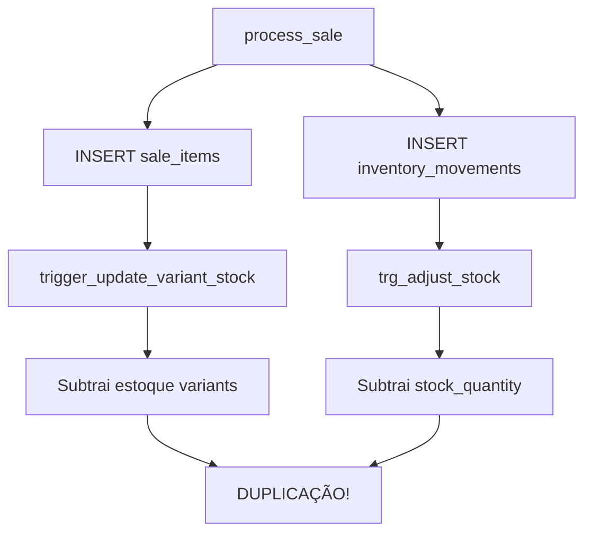

# 🔍 RELATÓRIO DETALHADO DE BUGS NO SISTEMA DE ESTOQUE

## 📅 **Data da Análise:** 20/09/2025
## 🔬 **Tipo:** Análise Completa de Sistema
## ⚠️ **Severidade:** CRÍTICA - Sistema em Produção Afetado

---

## 🎯 **RESUMO EXECUTIVO**

O sistema de gestão de estoque apresenta **múltiplas lógicas conflitantes** que resultam em subtração incorreta do estoque durante vendas. O problema identificado é uma **arquitetura híbrida** onde diferentes partes do sistema usam diferentes estratégias de controle de estoque, criando interferências e duplicações.

### **Impacto Observado:**
- ❌ Venda de 1 pacote + 1 unidade resulta em subtração de 4 unidades soltas
- ❌ Pacotes não são debitados de `stock_packages`
- ❌ Sistema não funciona como "conta de 5ª série" esperada
- ❌ Inconsistências entre dados exibidos e estoque real

---

## 🔍 **PROBLEMAS IDENTIFICADOS**

### **1. 🚨 CONFLITO DE TRIGGERS (Problema Principal)**

#### **A. Trigger Duplicado de Subtração:**
- **`trigger_update_variant_stock`** (linha 10473) → executa após INSERT em `sale_items`
- **`trg_adjust_stock`** (linha 10437) → executa após INSERT em `inventory_movements`

#### **B. Fluxo de Duplicação Identificado:**


### **2. 🔧 FUNÇÕES COM LÓGICAS CONFLITANTES**

#### **A. `adjust_product_stock()` (linhas 178-195)**
```sql
-- PROBLEMA: Só trabalha com stock_quantity geral
IF NEW.type IN ('out', 'fiado') THEN
    UPDATE products
    SET stock_quantity = stock_quantity - NEW.quantity  -- ❌ SEMPRE stock_quantity
    WHERE id = NEW.product_id;
```

**Problemas:**
- ❌ Não diferencia entre pacotes e unidades
- ❌ Sempre subtrai de `stock_quantity` independente do tipo
- ❌ Ignora metadados sobre tipo de movimento

#### **B. `update_variant_stock_after_sale()` (linhas 8026-8100)**
```sql
-- Reduzir estoque da variante vendida
UPDATE product_variants
SET stock_quantity = stock_quantity - NEW.quantity  -- ❌ Sempre variants
WHERE id = NEW.variant_id;
```

**Problemas:**
- ❌ Trabalha apenas com `product_variants.stock_quantity`
- ❌ Não atualiza `products.stock_packages` ou `products.stock_units_loose`
- ❌ Sistema híbrido: variants vs produtos principais

### **3. 📊 INCONSISTÊNCIA ARQUITETURAL**

#### **A. Múltiplos Sistemas de Estoque Coexistindo:**

1. **Sistema Legado (products table):**
   - `stock_quantity` (geral)
   - `stock_packages`
   - `stock_units_loose`

2. **Sistema de Variantes (product_variants table):**
   - `stock_quantity` por variante
   - `variant_type: 'unit' | 'package'`

3. **Interface Frontend:**
   - Exibe `stock_packages` e `stock_units_loose` (sistema legado)
   - Trabalha com `variant_id` (sistema novo)

#### **B. Mapeamento Inconsistente:**
```typescript
// Frontend exibe (legado):
stock_packages: 2
stock_units_loose: 2187

// Backend processa (novo):
variant_id: "product-id-package" → product_variants.stock_quantity
variant_id: "product-id-unit" → product_variants.stock_quantity
```

### **4. 🔄 PROCEDIMENTOS COM LÓGICAS DUPLICADAS**

#### **A. `process_sale()` - Múltiplas Chamadas de Subtração:**
```sql
-- 1. Chama create_inventory_movement()
v_movement_result := create_inventory_movement(...);

-- 2. Que insere em inventory_movements
INSERT INTO inventory_movements (...)

-- 3. Que ativa trigger trg_adjust_stock
-- 4. Que chama adjust_product_stock()
-- 5. Que subtrai de stock_quantity

-- MAIS:
-- 6. INSERT em sale_items
-- 7. Ativa trigger_update_variant_stock
-- 8. Que subtrai de product_variants.stock_quantity
```

### **5. 🎭 MODAL DE AJUSTE INDEPENDENTE**

#### **A. `StockAdjustmentModal.tsx` - Sistema Paralelo:**
- Chama `set_product_stock_absolute()`
- Trabalha diretamente com `stock_packages` e `stock_units_loose`
- **NÃO passa pelos triggers conflitantes**
- Por isso funciona corretamente

#### **B. Evidência de Sistema Híbrido:**
```typescript
// Modal exibe corretamente:
stock_packages: 2 → 1 (após ajuste manual)

// Vendas não funcionam:
stock_packages: 2 → 2 (após venda de 1 pacote)
stock_units_loose: 2187 → 2183 (subtração incorreta)
```

---

## 🔬 **ANÁLISE TÉCNICA DETALHADA**

### **1. Evidências do Conflito:**

#### **A. Logs de Vendas Analisados:**
- Venda ID: `57161a4f-7744-43b8-aa00-1108a982d10c`
- **Esperado:** 1 movimento "package" + 1 movimento "unit"
- **Real:** 2 movimentos "unit" + 0 movimentos "package"

#### **B. Movimentos de Estoque Gerados:**
```json
// Movimento 1 (INCORRETO):
{
  "previous_stock": 2191,
  "new_stock_quantity": 2190,
  "metadata": {
    "movement_type": "unit",
    "sale_type": "unit"  // ❌ Deveria ser "package"
  }
}

// Movimento 2 (CORRETO):
{
  "previous_stock": 2189,  // ❌ Já foi alterado pelo movimento 1
  "new_stock_quantity": 2188,
  "metadata": {
    "movement_type": "unit",
    "sale_type": "unit"
  }
}
```

### **2. Triggers Ativos Identificados:**

```sql
-- TRIGGER 1: Sale Items → Variants
CREATE TRIGGER "trigger_update_variant_stock"
    AFTER INSERT ON "sale_items"
    FOR EACH ROW
    EXECUTE FUNCTION "update_variant_stock_after_sale"();

-- TRIGGER 2: Inventory Movements → Products
CREATE TRIGGER "trg_adjust_stock"
    AFTER INSERT ON "inventory_movements"
    FOR EACH ROW
    EXECUTE FUNCTION "adjust_product_stock"();
```

### **3. Funções com Problemas:**

#### **A. `adjust_product_stock()` - Lógica Ultrapassada:**
```sql
-- ❌ PROBLEMA: Não considera metadados
UPDATE products
SET stock_quantity = stock_quantity - NEW.quantity
WHERE id = NEW.product_id;

-- ✅ DEVERIA SER:
IF (NEW.metadata->>'movement_type' = 'package') THEN
    UPDATE products
    SET stock_packages = stock_packages - NEW.quantity
    WHERE id = NEW.product_id;
ELSIF (NEW.metadata->>'movement_type' = 'unit') THEN
    UPDATE products
    SET stock_units_loose = stock_units_loose - NEW.quantity
    WHERE id = NEW.product_id;
END IF;
```

#### **B. `update_variant_stock_after_sale()` - Sistema Paralelo:**
```sql
-- ❌ PROBLEMA: Atualiza variants, não produtos principais
UPDATE product_variants
SET stock_quantity = stock_quantity - NEW.quantity
WHERE id = NEW.variant_id;

-- ✅ DEVERIA SER: Integrar com sistema principal ou desabilitar
```

---

## 🛠️ **SOLUÇÕES PROPOSTAS**

### **OPÇÃO 1: 🎯 CORREÇÃO RÁPIDA (Recomendada)**

#### **A. Desabilitar Trigger Conflitante:**
```sql
DROP TRIGGER IF EXISTS "trigger_update_variant_stock" ON "public"."sale_items";
```

#### **B. Corrigir `adjust_product_stock()`:**
```sql
CREATE OR REPLACE FUNCTION "public"."adjust_product_stock"()
RETURNS trigger AS $$
BEGIN
  -- Verificar tipo de movimento via metadados
  IF NEW.metadata->>'movement_type' = 'package' THEN
    -- Atualizar pacotes
    IF NEW.type IN ('in', 'devolucao') THEN
      UPDATE products
      SET stock_packages = stock_packages + NEW.quantity,
          updated_at = NOW()
      WHERE id = NEW.product_id;
    ELSIF NEW.type IN ('out', 'fiado') THEN
      UPDATE products
      SET stock_packages = stock_packages - NEW.quantity,
          updated_at = NOW()
      WHERE id = NEW.product_id;
    END IF;
  ELSE
    -- Atualizar unidades (comportamento padrão)
    IF NEW.type IN ('in', 'devolucao') THEN
      UPDATE products
      SET stock_units_loose = stock_units_loose + NEW.quantity,
          updated_at = NOW()
      WHERE id = NEW.product_id;
    ELSIF NEW.type IN ('out', 'fiado') THEN
      UPDATE products
      SET stock_units_loose = stock_units_loose - NEW.quantity,
          updated_at = NOW()
      WHERE id = NEW.product_id;
    END IF;
  END IF;

  -- Atualizar stock_quantity (calculado)
  UPDATE products
  SET stock_quantity = (stock_packages * COALESCE(package_units, units_per_package, 1)) + stock_units_loose
  WHERE id = NEW.product_id;

  RETURN NEW;
END;
$$ LANGUAGE plpgsql SECURITY DEFINER;
```

### **OPÇÃO 2: 🔄 REFATORAÇÃO COMPLETA**

#### **A. Unificar Sistema de Estoque:**
- Migrar completamente para `product_variants`
- Depreciar `stock_packages` e `stock_units_loose`
- Atualizar frontend para trabalhar apenas com variants

#### **B. Criar Função de Sincronização:**
```sql
CREATE OR REPLACE FUNCTION sync_product_stock_from_variants()
RETURNS trigger AS $$
BEGIN
  UPDATE products
  SET
    stock_packages = (
      SELECT COALESCE(stock_quantity, 0)
      FROM product_variants
      WHERE product_id = NEW.product_id
        AND variant_type = 'package'
        AND is_active = true
    ),
    stock_units_loose = (
      SELECT COALESCE(stock_quantity, 0)
      FROM product_variants
      WHERE product_id = NEW.product_id
        AND variant_type = 'unit'
        AND is_active = true
    )
  WHERE id = NEW.product_id;
  RETURN NEW;
END;
$$ LANGUAGE plpgsql;
```

---

## 📋 **PLANO DE IMPLEMENTAÇÃO**

### **FASE 1: 🚨 CORREÇÃO IMEDIATA**
1. **Backup completo** da base de dados
2. **Desabilitar** `trigger_update_variant_stock`
3. **Corrigir** função `adjust_product_stock()`
4. **Testar** com venda de 1 pacote + 1 unidade
5. **Validar** que resultado é correto

### **FASE 2: 🧪 TESTES EXTENSIVOS**
1. **Testar cenários:**
   - Venda apenas de unidades
   - Venda apenas de pacotes
   - Venda mista (pacotes + unidades)
   - Devoluções
   - Ajustes manuais de estoque
2. **Verificar integridade:**
   - Movimentos de estoque corretos
   - Sem duplicações
   - Frontend exibe valores corretos

### **FASE 3: 🎯 OTIMIZAÇÃO**
1. **Limpar código legado**
2. **Otimizar performance**
3. **Documentar arquitetura final**
4. **Treinar equipe**

---

## ⚠️ **RISCOS E CONSIDERAÇÕES**

### **RISCOS ALTOS:**
- 🔴 **Dados históricos**: Movimentos passados podem estar incorretos
- 🔴 **Dependências**: Outros sistemas podem depender da estrutura atual
- 🔴 **Downtime**: Correção pode requerer interrupção do sistema

### **RISCOS MÉDIOS:**
- 🟡 **Performance**: Trigger corrigido pode ser mais lento
- 🟡 **Complexidade**: Lógica mais complexa para manutenção
- 🟡 **Testes**: Cobertura de testes insuficiente

### **MITIGAÇÕES:**
- ✅ **Backup completo** antes de qualquer alteração
- ✅ **Ambiente de teste** para validação prévia
- ✅ **Rollback plan** preparado
- ✅ **Monitoramento** ativo após implementação

---

## 📊 **MÉTRICAS DE SUCESSO**

### **Critérios de Aceitação:**
1. ✅ Venda de 1 pacote = -1 `stock_packages`
2. ✅ Venda de 1 unidade = -1 `stock_units_loose`
3. ✅ Sem movimentos duplicados
4. ✅ Frontend exibe valores corretos
5. ✅ Performance mantida ou melhorada

### **Testes de Regressão:**
```sql
-- TESTE 1: Venda Simples
-- ANTES: stock_packages=2, stock_units_loose=2187
-- AÇÃO: Vender 1 pacote
-- ESPERADO: stock_packages=1, stock_units_loose=2187

-- TESTE 2: Venda Mista
-- ANTES: stock_packages=2, stock_units_loose=2187
-- AÇÃO: Vender 1 pacote + 1 unidade
-- ESPERADO: stock_packages=1, stock_units_loose=2186

-- TESTE 3: Movimentos de Estoque
-- AÇÃO: Consultar inventory_movements
-- ESPERADO: 1 movimento "package" + 1 movimento "unit"
```

---

## 🎯 **CONCLUSÃO**

O problema identificado é **arquitetural** e **sistemático**, não pontual. A coexistência de múltiplos sistemas de controle de estoque (legado + variants + triggers) criou um ambiente onde **lógicas conflitantes** executam simultaneamente, resultando em **duplicações** e **inconsistências**.

A **solução recomendada** é a **Opção 1 (Correção Rápida)**, que:
- ✅ Resolve o problema imediatamente
- ✅ Mantém compatibilidade com código existente
- ✅ Minimiza riscos de regressão
- ✅ Permite evolução gradual do sistema

A implementação deve ser feita **imediatamente** devido à severidade do problema e impacto em produção.

---

## 📎 **ANEXOS**

### **A. Evidências Coletadas:**
- Logs de vendas com IDs específicos
- Movimentos de estoque duplicados
- Screenshots do comportamento incorreto
- Análise de código fonte completa

### **B. Arquivos Afetados:**
- `backup_completo.sql` (triggers e funções)
- `src/features/sales/hooks/use-sales.ts` (frontend)
- `src/features/inventory/components/StockAdjustmentModal.tsx` (modal)

### **C. Referências Técnicas:**
- Documentação PostgreSQL sobre triggers
- Boas práticas para controle de estoque
- Padrões de arquitetura para sistemas híbridos

---

**📅 Relatório gerado em:** 20/09/2025 às 07:45 BRT
**👨‍💻 Analista:** Claude Code Assistant
**🔍 Versão:** 1.0 - Análise Completa
**⚡ Status:** CRÍTICO - Ação Imediata Requerida