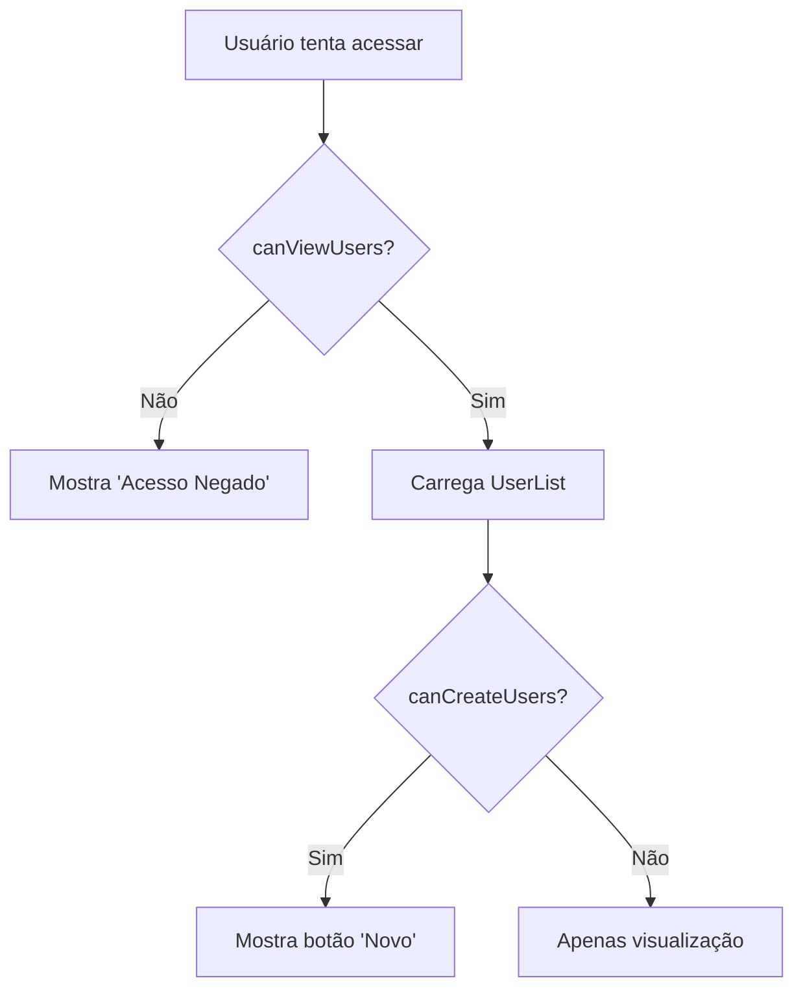

# 🔐 Usuário - Documentação de Padrões e Hooks

## 📋 Visão Geral

A página de **Usuários** é o centro de controle administrativo do sistema, responsável por gerenciar contas de usuário, permissões e configuração inicial. Implementada com arquitetura modular e hooks especializados para máxima eficiência e segurança.

### Localização dos Arquivos
- **Componente Principal**: `src/features/users/components/UserManagement.tsx`
- **Hooks**: `src/features/users/hooks/`
- **Tipos**: `src/features/users/types/`
- **Testes**: `src/features/users/hooks/__tests__/`

---

## 🏗️ Arquitetura dos Componentes

### Componente Principal
```typescript
UserManagement.tsx (195 linhas)
├── FirstAdminSetup - Setup inicial do sistema
├── UserList - Lista/tabela de usuários  
├── UserCreateDialog - Modal de criação
├── CategoryManagement - Gerenciamento de categorias
└── Hooks especializados (4 hooks customizados)
```

### Hierarquia de Responsabilidades
1. **UserManagement** - Orquestração geral e estado da UI
2. **UserList** - Apresentação e interações da tabela
3. **UserForm** - Formulário com validação e UX avançada
4. **UserActions** - Ações por usuário (editar, deletar)
5. **UserRoleBadge** - Indicadores visuais de função

---

## 🎯 Hooks Especializados

### 1. `useUserManagement.ts` - Gerenciamento Geral
```typescript
// Hook principal para operações CRUD de usuários
const { users, isLoading, error, refreshUsers } = useUserManagement();

// Implementação com React Query
const { data: users, isLoading, refetch, error } = useQuery({
  queryKey: ['users', 'management'],
  queryFn: async (): Promise<User[]> => {
    const { data, error } = await supabase
      .from('profiles')
      .select('*')
      .order('created_at', { ascending: true });
    
    if (error) throw error;
    return data as User[];
  },
  enabled: true,
});
```

**Características:**
- ✅ React Query para cache inteligente
- ✅ Error handling com estado local
- ✅ Refresh manual otimizado
- ✅ TypeScript strict com interfaces

### 2. `useUserPermissions.ts` - Controle de Acesso
```typescript
// Hook para verificação de permissões
const { canCreateUsers, canEditUsers, canDeleteUsers, canViewUsers } = useUserPermissions();

// Utilitários de função
const { getRoleDisplay, getRoleColor, getRoleDescription, isSupremeAdmin } = useRoleUtilities();

// Implementação baseada em Auth Context
const permissions = useMemo(() => {
  const isAdmin = userRole === 'admin';
  const hasAdminAccess = hasPermission('admin');
  
  return {
    canCreateUsers: isAdmin,
    canEditUsers: isAdmin, 
    canDeleteUsers: isAdmin,
    canViewUsers: hasAdminAccess,
    hasAdminAccess,
  };
}, [userRole, hasPermission]);
```

**Características:**
- 🔐 **Controle granular de permissões** por ação
- 👑 **Supreme Admin** (`adm@adm.com`) com privilégios especiais
- 🎨 **Utilitários de apresentação** para roles
- 🚀 **Memoização** para performance otimizada

### 3. `useUserCreation.ts` - Criação de Usuários
```typescript
// Hook para criação de usuários e primeiro admin
const { createUser, createFirstAdmin, isCreating } = useUserCreation();

// Funcionalidades específicas:
- Validação de dados antes do envio
- Integração com Supabase Auth
- Criação automática de profile
- Feedback visual durante operação
```

### 4. `useFirstAdminSetup.ts` - Setup Inicial
```typescript
// Hook para detecção e configuração inicial
const { showFirstAdminSetup, isSettingUp } = useFirstAdminSetup();

// Lógica de detecção:
- Verifica se existem usuários no sistema
- Apresenta tela de setup se necessário
- Configura primeiro administrador
```

---

## 🎨 Padrões de UI/UX Implementados

### 1. **Glassmorphism Avançado**
```typescript
// Card principal com efeito de movimento do mouse
<Card 
  className="bg-gray-800/30 border-gray-700/40 backdrop-blur-sm shadow-lg hover:shadow-2xl hover:shadow-purple-500/10 hover:border-purple-400/30 transition-all duration-300 relative overflow-hidden group"
  onMouseMove={(e) => {
    const rect = (e.currentTarget as HTMLElement).getBoundingClientRect();
    const x = ((e.clientX - rect.left) / rect.width) * 100;
    const y = ((e.clientY - rect.top) / rect.height) * 100;
    (e.currentTarget as HTMLElement).style.setProperty("--x", `${x}%`);
    (e.currentTarget as HTMLElement).style.setProperty("--y", `${y}%`);
  }}
>
```

### 2. **BlurIn Animation no Header**
```typescript
<BlurIn
  word="ADMINISTRAÇÃO DO SISTEMA"
  duration={1.2}
  variant={{
    hidden: { filter: "blur(15px)", opacity: 0 },
    visible: { filter: "blur(0px)", opacity: 1 }
  }}
  className="text-xl lg:text-2xl font-bold text-transparent bg-clip-text bg-gradient-to-r from-[#FF2400] via-[#FFDA04] to-[#FF2400] drop-shadow-lg"
/>
```

### 3. **Sistema de Abas Moderno**
```typescript
// Navegação entre Usuários e Categorias
<div className="flex items-center gap-1 mt-4 bg-black/40 backdrop-blur-sm rounded-lg p-1 border border-white/10">
  {/* Aba ativa com destaque dourado */}
  activeTab === 'users' 
    ? "bg-[#FFD700]/20 text-[#FFD700] border border-[#FFD700]/30"
    : "text-gray-400 hover:text-gray-200 hover:bg-white/5"
</div>
```

### 4. **Indicadores Visuais de Função**
```typescript
// UserForm com preview da função selecionada
<div className={`p-4 rounded-xl border-2 transition-all duration-300 ${
  formData.role === 'admin' 
    ? 'bg-red-500/10 border-red-400 shadow-lg shadow-red-500/20' 
    : formData.role === 'employee'
    ? 'bg-blue-500/10 border-blue-400 shadow-lg shadow-blue-500/20'
    : 'bg-green-500/10 border-green-400 shadow-lg shadow-green-500/20'
}`}>
```

---

## 🔒 Sistema de Roles e Permissões

### Tipos de Usuário
```typescript
type UserRole = 'admin' | 'employee' | 'delivery';

// Admin (Crown Icon - Vermelho)
- Acesso total ao sistema
- Gerenciamento de usuários
- Configurações avançadas

// Employee (User Icon - Azul)  
- Vendas, estoque, clientes
- Relatórios (sem dados sensíveis de faturamento)
- Operações do dia a dia

// Delivery (Truck Icon - Verde)
- Apenas suas entregas
- Status de delivery
- Acesso limitado
```

### Controle de Acesso Granular
```typescript
// Verificações por ação específica
canCreateUsers: isAdmin,
canEditUsers: isAdmin,
canDeleteUsers: isAdmin,
canViewUsers: hasAdminAccess,

// Supreme Admin especial
isSupremeAdmin = (email: string): boolean => {
  return email === 'adm@adm.com';
}
```

---

## 📊 Funcionalidades da UserList

### 1. **Busca e Filtros Avançados**
```typescript
// SearchBar21st com debounce integrado
<SearchBar21st 
  placeholder="Buscar usuários..." 
  value={searchTerm} 
  onChange={setSearchTerm} 
  debounceMs={150} 
/>

// Filtros aplicados em tempo real
const dataset = React.useMemo(() => {
  const term = searchTerm.trim().toLowerCase();
  let rows = term
    ? users.filter(u =>
        (u.name || '').toLowerCase().includes(term) ||
        (u.email || '').toLowerCase().includes(term) ||
        (u.role || '').toLowerCase().includes(term)
      )
    : users;
  // Ordenação dinâmica aplicada...
}, [users, searchTerm, sortField, sortDirection]);
```

### 2. **Colunas Configuráveis**
```typescript
const ALL_COLUMNS = ['Nome', 'Email', 'Função', 'Criado em', 'Ações'];
const [visibleColumns, setVisibleColumns] = useState<string[]>([...ALL_COLUMNS]);

// DropdownMenu para seleção de colunas
<DropdownMenuCheckboxItem
  key={col}
  checked={visibleColumns.includes(col)}
  onCheckedChange={() => setVisibleColumns(prev => 
    prev.includes(col) ? prev.filter(c => c !== col) : [...prev, col]
  )}
>
```

### 3. **Ordenação Interativa**
```typescript
// Headers clicáveis com ícones animados
const icon = (field: typeof sortField) => 
  sortField !== field ? <ArrowUpDown className="w-4 h-4" /> : 
  (sortDirection === 'asc' ? <ArrowUp className="w-4 h-4" /> : <ArrowDown className="w-4 h-4" />);

// Lógica de ordenação com tipos especiais
if (sortField === 'created_at') {
  const at = new Date(av).getTime();
  const bt = new Date(bv).getTime(); 
  return sortDirection === 'asc' ? at - bt : bt - at;
}
```

---

## 🎯 Validação e UX do UserForm

### 1. **Validação em Tempo Real**
```typescript
// Estados de erro com feedback visual
aria-invalid={!formData.name && formData.name !== ''}
aria-describedby="user-name-error"

{!formData.name && formData.name !== '' && (
  <p id="user-name-error" className="text-sm text-red-400 mt-2" role="alert">
    ⚠️ Nome é obrigatório
  </p>
)}
```

### 2. **Seletor de Função Visual**
```typescript
// Preview dinâmico da função selecionada com cores e ícones
<div className="flex items-center gap-3 mb-2">
  {formData.role === 'admin' && <Crown className="h-6 w-6 text-red-400" />}
  {formData.role === 'employee' && <User className="h-6 w-6 text-blue-400" />}
  {formData.role === 'delivery' && <Truck className="h-6 w-6 text-green-400" />}
</div>
```

### 3. **Comparativo de Permissões**
```typescript
// Seção educativa sobre níveis de acesso
<div className="grid gap-3">
  <div className="flex items-start gap-3 p-3 bg-red-500/5 border border-red-500/20 rounded-lg">
    <Crown className="h-5 w-5 text-red-400 mt-0.5" />
    <div>
      <div className="font-medium text-red-300">Administrador</div>
      <div className="text-white/70 text-sm">{getRoleDescription('admin')}</div>
    </div>
  </div>
  // Outros níveis...
</div>
```

---

## 🔄 Fluxos de Operação

### 1. **Primeiro Acesso (First Admin Setup)**
```mermaid
graph TD
    A[Usuário acessa sistema] --> B{Existem usuários?}
    B -->|Não| C[Mostra FirstAdminSetup]
    C --> D[Preenche dados admin]
    D --> E[createFirstAdmin()]
    E --> F[Refresh da lista]
    F --> G[Tela principal]
    B -->|Sim| G
```

### 2. **Criação de Usuário Normal**
```mermaid  
graph TD
    A[Click 'Novo Usuário'] --> B[Abre UserCreateDialog]
    B --> C[UserForm com validação]
    C --> D{Dados válidos?}
    D -->|Não| C
    D -->|Sim| E[createUser()]
    E --> F[Fecha dialog]
    F --> G[refreshUsers()]
```

### 3. **Controle de Acesso**


---

## 🚀 Performance e Otimizações

### 1. **React Query Cache**
```typescript
// Cache inteligente com staleTime
queryKey: ['users', 'management'],
enabled: true, // Always fetch when component mounts
staleTime: 5 * 60 * 1000, // 5 minutos
```

### 2. **Memoização de Cálculos**
```typescript
// Filtros e ordenação memoizados
const dataset = React.useMemo(() => {
  // Processamento pesado apenas quando dependências mudam
}, [users, searchTerm, sortField, sortDirection]);

// Permissões memoizadas
const permissions = useMemo(() => {
  // Cálculo de permissões otimizado
}, [userRole, hasPermission]);
```

### 3. **Componentes Lazy e Code Splitting**
```typescript
// Componentização para reduzir bundle
import { FirstAdminSetup } from './FirstAdminSetup';
import { UserList } from './UserList';
import { UserCreateDialog } from './UserCreateDialog';
```

---

## 🧪 Padrões de Teste

### Estrutura de Testes
```
hooks/__tests__/
├── useUserManagement.test.ts
├── useUserManagement.test.tsx  
└── Cobertura de:
    ├── Casos de sucesso
    ├── Casos de erro
    ├── Estados de loading
    └── Integração com Supabase
```

---

## 🎨 Tokens de Design

### Cores por Função
```typescript
// Admin - Vermelho
'bg-red-500/20 text-red-400 border-red-500/30'

// Employee - Azul  
'bg-blue-500/20 text-blue-400 border-blue-500/30'

// Delivery - Verde
'bg-green-500/20 text-green-400 border-green-500/30'
```

### Animações Características
- **BlurIn** para título principal (1.2s)
- **Hover effects** com scale transform (scale-105)
- **Mouse tracking** para glassmorphism
- **Spin animation** em botões de refresh

### Tipografia
- **Headers**: Gradient text com text-shadow
- **Labels**: font-medium text-white
- **Descrições**: text-white/70 text-sm
- **Erros**: text-red-400 com ⚠️ emoji

---

## 📈 Métricas e Analytics

### Estados Monitorados
```typescript
// Loading states
isLoading: boolean (useUserManagement)
isCreating: boolean (useUserCreation)  
isSettingUp: boolean (useFirstAdminSetup)
isRefreshing: boolean (UserList)

// Success/Error tracking
error: string | null
toast notifications para feedback
```

### Eventos de Usuário
- ✅ **Lista atualizada** (refresh manual)
- ❌ **Erro ao atualizar** (falha na query)
- 🆕 **Usuário criado** (sucesso na criação)
- 🔑 **Primeiro admin configurado** (setup inicial)

---

## 🔧 Configurações e Customização

### Roles Customizáveis
```typescript
// Facilmente extensível para novas funções
type UserRole = 'admin' | 'employee' | 'delivery' | 'custom';

const getRoleDescription = (role: UserRole): string => {
  // Adicionando novas descrições conforme necessário
}
```

### Permissões Granulares
```typescript
// Sistema baseado em capabilities
const capabilities = {
  'users.create': isAdmin,
  'users.edit': isAdmin,
  'users.delete': isAdmin && !isSupremeAdmin(targetUser.email),
  'users.view': hasAdminAccess,
}
```

---

## 🎯 Conclusão

A página de **Usuários** representa um exemplo avançado de:

✅ **Arquitetura modular** com separação clara de responsabilidades  
✅ **Hooks especializados** para lógica de negócio reutilizável  
✅ **UI/UX moderna** com glassmorphism e animações suaves  
✅ **Sistema robusto de permissões** com controle granular  
✅ **Performance otimizada** com React Query e memoização  
✅ **Acessibilidade** com ARIA labels e navegação por teclado  
✅ **TypeScript rigoroso** com interfaces bem definidas  
✅ **Testes abrangentes** cobrindo casos críticos  

**Total de Linhas de Código**: ~800 linhas organizadas em 9 arquivos especializados
**Hooks Customizados**: 4 hooks com responsabilidades específicas  
**Componentes**: 8 componentes reutilizáveis e testáveis
**Cobertura de Testes**: Hooks críticos com testes unitários e de integração

Este módulo estabelece o padrão para **gerenciamento administrativo** no sistema, sendo facilmente extensível para novas funcionalidades e perfis de usuário.