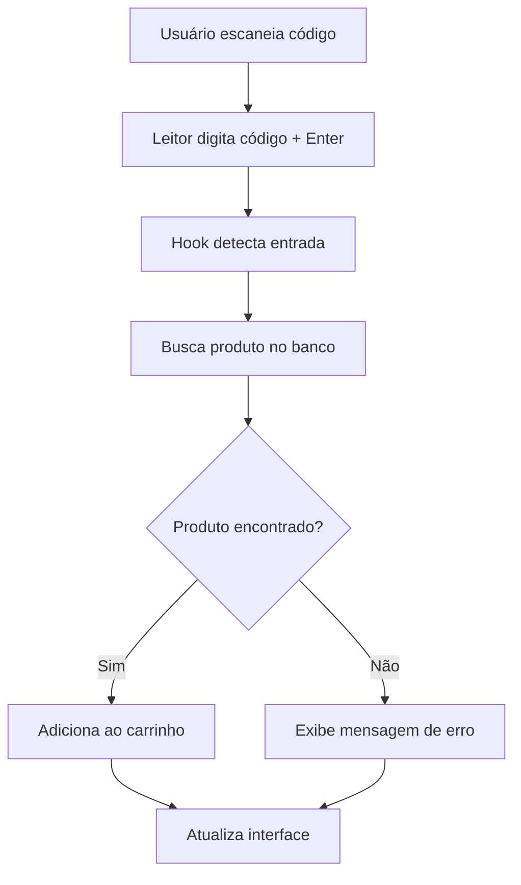

# INTEGRAÇÃO COM LEITOR DE CÓDIGO DE BARRAS

> **Última Atualização**: 25/07/2025 - Documentação completa para implementação

## 1. Visão Geral

Esta documentação detalha a implementação completa da integração com leitor de código de barras USB **Knup KP-1026** no sistema Adega Manager. O leitor funciona como dispositivo de entrada USB (teclado), digitando códigos automaticamente seguidos de Enter, permitindo busca instantânea de produtos durante o processo de vendas.

### 🎯 **Objetivos**
- Acelerar o processo de busca de produtos nas vendas
- Reduzir erros humanos na digitação de códigos
- Melhorar a experiência do usuário no ponto de venda
- Manter compatibilidade com o fluxo de vendas existente

### ✅ **Hardware Validado**
- **Modelo**: Knup KP-1026 USB Barcode Scanner
- **Funcionamento**: Dispositivo HID (Human Interface Device)
- **Compatibilidade**: EAN-13, EAN-8, UPC, Code 128, Code 39
- **Performance**: 300 leituras/segundo
- **Feedback**: Sonoro e luminoso integrados

---

## 2. Arquitetura Técnica

### 📋 **Componentes Necessários**

| Componente | Arquivo | Funcionalidade | Status |
|------------|---------|----------------|--------|
| **Hook Principal** | `src/hooks/use-barcode.ts` | Gerencia busca por código de barras | ⏳ A implementar |
| **Componente Scanner** | `src/components/inventory/BarcodeInput.tsx` | Interface de entrada de código | ⏳ A implementar |
| **Integração Vendas** | `src/components/sales/ProductsGrid.tsx` | Busca integrada ao grid de produtos | 🔧 Modificar existente |
| **Tipos** | `src/types/inventory.types.ts` | Interfaces para código de barras | 🔧 Estender existente |

### 🔄 **Fluxo de Funcionamento**



### 🏗️ **Integração com Arquitetura Existente**

- **Hook `useCart`**: Utilizará método `addItem()` existente
- **Hook `useProducts`**: Será estendido com busca por barcode  
- **Componente `ProductsGrid`**: Receberá input de código de barras
- **Padrão shadcn/ui**: Componentes seguirão design system atual

---

## 3. Implementação no Backend

### 🗃️ **Modificações na Tabela Products**

#### **3.1. Alteração SQL Necessária**

```sql
-- Adicionar campo barcode com constraint de unicidade
ALTER TABLE products 
ADD COLUMN barcode VARCHAR(50) UNIQUE;

-- Criar índice para performance otimizada
CREATE INDEX idx_products_barcode ON products(barcode);

-- Comentário descritivo
COMMENT ON COLUMN products.barcode IS 'Código de barras único do produto (EAN-13, UPC, etc.)';

-- Política RLS para código de barras (seguindo padrões existentes)
ALTER TABLE products ENABLE ROW LEVEL SECURITY;
```

#### **3.2. Atualização dos Tipos TypeScript**

```typescript
// src/integrations/supabase/types.ts
export interface Database {
  public: {
    Tables: {
      products: {
        Row: {
          // ... campos existentes
          barcode: string | null        // Código de barras único
        }
        Insert: {
          // ... campos existentes  
          barcode?: string | null
        }
        Update: {
          // ... campos existentes
          barcode?: string | null
        }
      }
    }
  }
}
```

#### **3.3. Validações e Constraints**

```sql
-- Validação de formato (apenas números para EAN-13)
ALTER TABLE products 
ADD CONSTRAINT check_barcode_format 
CHECK (barcode IS NULL OR (barcode ~ '^[0-9]{8,14}$'));

-- Trigger para auditoria de alterações
CREATE OR REPLACE FUNCTION audit_barcode_changes()
RETURNS TRIGGER AS $$
BEGIN
  IF OLD.barcode IS DISTINCT FROM NEW.barcode THEN
    INSERT INTO audit_logs (table_name, operation, old_values, new_values, user_id)
    VALUES ('products', 'UPDATE', 
            jsonb_build_object('barcode', OLD.barcode),
            jsonb_build_object('barcode', NEW.barcode),
            auth.uid());
  END IF;
  RETURN NEW;
END;
$$ LANGUAGE plpgsql;

CREATE TRIGGER trigger_audit_barcode_changes
  BEFORE UPDATE ON products
  FOR EACH ROW
  EXECUTE FUNCTION audit_barcode_changes();
```

---

## 4. Integração com Módulos Existentes

### 🛒 **4.1. Módulo de Vendas**

#### **Modificação em ProductsGrid.tsx**
```typescript
// src/components/sales/ProductsGrid.tsx
import { BarcodeInput } from '@/components/inventory/BarcodeInput';
import { useBarcode } from '@/hooks/use-barcode';

export const ProductsGrid: React.FC = () => {
  const { addItem } = useCart();
  const { searchByBarcode, isLoading } = useBarcode();

  const handleBarcodeScanned = async (barcode: string) => {
    const product = await searchByBarcode(barcode);
    if (product) {
      addItem({
        id: product.id,
        name: product.name,
        price: product.price,
        quantity: 1,
        maxQuantity: product.stock_quantity
      });
    }
  };

  return (
    <div className="space-y-4">
      <BarcodeInput onScan={handleBarcodeScanned} disabled={isLoading} />
      {/* Grid de produtos existente */}
    </div>
  );
};
```

#### **Extensão do Hook useProducts**
```typescript
// src/hooks/use-product.ts (extensão)
export const useProductByBarcode = (barcode: string | null) => {
  return useQuery({
    queryKey: ['product', 'barcode', barcode],
    queryFn: async () => {
      if (!barcode) return null;
      
      const { data, error } = await supabase
        .from('products')
        .select('*')
        .eq('barcode', barcode)
        .single();

      if (error && error.code !== 'PGRST116') {
        throw error;
      }
      
      return data;
    },
    enabled: !!barcode
  });
};
```

### 📦 **4.2. Módulo de Inventário**

#### **Modificação em ProductForm.tsx**
```typescript
// src/components/inventory/ProductForm.tsx (adição de campo)
const ProductForm: React.FC<ProductFormProps> = ({ product, onSubmit }) => {
  const form = useForm<ProductFormData>({
    defaultValues: {
      // ... valores existentes
      barcode: product?.barcode || '',
    }
  });

  return (
    <Form {...form}>
      {/* Campos existentes */}
      
      <FormField
        control={form.control}
        name="barcode"
        render={({ field }) => (
          <FormItem>
            <FormLabel>Código de Barras</FormLabel>
            <FormControl>
              <Input
                placeholder="Digite ou escaneie o código"
                {...field}
                onChange={(e) => {
                  const value = e.target.value.replace(/\D/g, ''); // Apenas números
                  field.onChange(value);
                }}
                maxLength={14}
              />
            </FormControl>
            <FormDescription>
              Código EAN-13, UPC ou similar (apenas números)
            </FormDescription>
            <FormMessage />
          </FormItem>
        )}
      />
      
      {/* Demais campos do formulário */}
    </Form>
  );
};
```

---

## 5. Cronograma de Implementação

### 🚀 **Fase 1: Preparação da Infraestrutura** (1-2 dias)

#### **Tarefas:**
- [ ] Executar migração SQL para adicionar campo `barcode`
- [ ] Atualizar tipos TypeScript em `src/integrations/supabase/types.ts`
- [ ] Estender interfaces em `src/types/inventory.types.ts`
- [ ] Configurar validações e constraints no banco

#### **Entregáveis:**
- Campo `barcode` ativo na tabela products
- Tipos atualizados e funcionais
- Validações de formato implementadas

### 🔧 **Fase 2: Componentes Base** (2-3 dias)

#### **Tarefas:**
- [ ] Criar hook `src/hooks/use-barcode.ts`
- [ ] Implementar componente `src/components/inventory/BarcodeInput.tsx`
- [ ] Adicionar extensão `useProductByBarcode` ao hook products
- [ ] Criar tipos específicos para operações de barcode

#### **Entregáveis:**
- Hook funcional para busca por código de barras
- Componente de input com detecção automática
- Integração com React Query configurada

### 🛒 **Fase 3: Integração com Vendas** (2 dias)

#### **Tarefas:**
- [ ] Modificar `ProductsGrid.tsx` para incluir BarcodeInput
- [ ] Integrar busca por barcode com carrinho de compras
- [ ] Testar fluxo completo de escaneamento → busca → adição ao carrinho
- [ ] Implementar tratamento de erros e feedback visual

#### **Entregáveis:**
- Vendas funcionando com código de barras
- Fluxo integrado e testado
- Experiência do usuário otimizada

### 📦 **Fase 4: Integração com Inventário** (1-2 dias)

#### **Tarefas:**
- [ ] Adicionar campo barcode ao `ProductForm.tsx`
- [ ] Implementar validação de unicidade no frontend
- [ ] Integrar com hooks de criação/edição de produtos
- [ ] Adicionar funcionalidade de escaneamento no formulário

#### **Entregáveis:**
- Formulário de produtos com suporte a código de barras
- Validações frontend implementadas
- Cadastro completo funcionando

### ✅ **Fase 5: Testes e Refinamentos** (1-2 dias)

#### **Tarefas:**
- [ ] Testes de integração com leitor físico
- [ ] Validação de diferentes tipos de código (EAN-13, UPC, etc.)
- [ ] Otimização de performance das buscas
- [ ] Documentação de uso para equipe

#### **Entregáveis:**
- Sistema completo testado e validado
- Performance otimizada
- Documentação de operação atualizada

---

## 6. Código de Exemplo

### 🔌 **6.1. Hook use-barcode.ts**

```typescript
// src/hooks/use-barcode.ts
import { useState, useCallback } from 'react';
import { useQuery, useMutation, useQueryClient } from '@tanstack/react-query';
import { supabase } from '@/integrations/supabase/client';
import { useToast } from '@/hooks/use-toast';
import type { Product } from '@/types/inventory.types';

interface BarcodeSearchResult {
  product: Product | null;
  found: boolean;
  error?: string;
}

export const useBarcode = () => {
  const [lastScannedCode, setLastScannedCode] = useState<string | null>(null);
  const { toast } = useToast();
  const queryClient = useQueryClient();

  // Busca produto por código de barras
  const searchByBarcode = useCallback(async (barcode: string): Promise<Product | null> => {
    if (!barcode || barcode.length < 8) {
      toast({
        title: "Código inválido",
        description: "O código de barras deve ter pelo menos 8 dígitos",
        variant: "destructive"
      });
      return null;
    }

    try {
      const { data, error } = await supabase
        .from('products')
        .select('*')
        .eq('barcode', barcode)
        .single();

      if (error) {
        if (error.code === 'PGRST116') {
          toast({
            title: "Produto não encontrado",
            description: `Nenhum produto encontrado com o código ${barcode}`,
            variant: "destructive"
          });
          return null;
        }
        throw error;
      }

      setLastScannedCode(barcode);
      
      toast({
        title: "Produto encontrado",
        description: `${data.name} adicionado com sucesso`,
        variant: "default"
      });

      return data;
    } catch (error) {
      console.error('Erro ao buscar produto por código de barras:', error);
      toast({
        title: "Erro na busca",
        description: "Ocorreu um erro ao buscar o produto. Tente novamente.",
        variant: "destructive"
      });
      return null;
    }
  }, [toast]);

  // Validação de código de barras
  const validateBarcode = useCallback((barcode: string): boolean => {
    // Remove espaços e caracteres não numéricos
    const cleanCode = barcode.replace(/\D/g, '');
    
    // Valida comprimento (EAN-8, EAN-13, UPC)
    if (![8, 12, 13, 14].includes(cleanCode.length)) {
      return false;
    }

    // Validação básica do dígito verificador para EAN-13
    if (cleanCode.length === 13) {
      let sum = 0;
      for (let i = 0; i < 12; i++) {
        sum += parseInt(cleanCode[i]) * (i % 2 === 0 ? 1 : 3);
      }
      const checkDigit = (10 - (sum % 10)) % 10;
      return checkDigit === parseInt(cleanCode[12]);
    }

    return true; // Para outros formatos, aceita se o comprimento estiver correto
  }, []);

  // Mutation para atualizar código de barras de um produto
  const updateProductBarcode = useMutation({
    mutationFn: async ({ productId, barcode }: { productId: string; barcode: string }) => {
      const { data, error } = await supabase
        .from('products')
        .update({ barcode })
        .eq('id', productId)
        .select()
        .single();

      if (error) throw error;
      return data;
    },
    onSuccess: (data) => {
      queryClient.invalidateQueries({ queryKey: ['products'] });
      toast({
        title: "Código atualizado",
        description: `Código de barras do produto ${data.name} atualizado com sucesso`,
      });
    },
    onError: (error: any) => {
      toast({
        title: "Erro ao atualizar",
        description: error.message || "Erro ao atualizar código de barras",
        variant: "destructive"
      });
    }
  });

  return {
    searchByBarcode,
    validateBarcode,
    updateProductBarcode: updateProductBarcode.mutate,
    isUpdating: updateProductBarcode.isPending,
    lastScannedCode,
    clearLastScanned: () => setLastScannedCode(null)
  };
};

export default useBarcode;
```

### 🎯 **6.2. Componente BarcodeInput.tsx**

```typescript
// src/components/inventory/BarcodeInput.tsx
import React, { useState, useRef, useEffect } from 'react';
import { Input } from '@/components/ui/input';
import { Button } from '@/components/ui/button';
import { Label } from '@/components/ui/label';
import { useBarcode } from '@/hooks/use-barcode';
import { Scan, Loader2 } from 'lucide-react';

interface BarcodeInputProps {
  onScan: (barcode: string) => Promise<void>;
  disabled?: boolean;
  placeholder?: string;
  autoFocus?: boolean;
  className?: string;
}

export const BarcodeInput: React.FC<BarcodeInputProps> = ({
  onScan,
  disabled = false,
  placeholder = "Escaneie ou digite o código de barras",
  autoFocus = true,
  className = ""
}) => {
  const [barcode, setBarcode] = useState('');
  const [isProcessing, setIsProcessing] = useState(false);
  const inputRef = useRef<HTMLInputElement>(null);
  const { validateBarcode } = useBarcode();

  // Foco automático no input (útil após processar um código)
  useEffect(() => {
    if (autoFocus && inputRef.current && !isProcessing) {
      inputRef.current.focus();
    }
  }, [autoFocus, isProcessing]);

  // Detecta entrada automática do leitor (código seguido de Enter rapidamente)
  const handleKeyDown = async (e: React.KeyboardEvent<HTMLInputElement>) => {
    if (e.key === 'Enter' && barcode.trim()) {
      e.preventDefault();
      await processBarcode(barcode.trim());
    }
  };

  // Processa o código escaneado ou digitado
  const processBarcode = async (code: string) => {
    if (isProcessing || disabled) return;

    // Validação básica
    if (!validateBarcode(code)) {
      setBarcode('');
      return;
    }

    setIsProcessing(true);
    
    try {
      await onScan(code);
      setBarcode(''); // Limpa o input após processar
    } catch (error) {
      console.error('Erro ao processar código de barras:', error);
    } finally {
      setIsProcessing(false);
      // Retorna foco ao input
      if (inputRef.current) {
        inputRef.current.focus();
      }
    }
  };

  const handleManualScan = () => {
    if (barcode.trim()) {
      processBarcode(barcode.trim());
    }
  };

  return (
    <div className={`space-y-2 ${className}`}>
      <Label htmlFor="barcode-input" className="text-sm font-medium">
        Código de Barras
      </Label>
      <div className="flex gap-2">
        <Input
          id="barcode-input"
          ref={inputRef}
          type="text"
          value={barcode}
          onChange={(e) => setBarcode(e.target.value.replace(/\D/g, ''))} // Apenas números
          onKeyDown={handleKeyDown}
          placeholder={placeholder}
          disabled={disabled || isProcessing}
          maxLength={14}
          className="font-mono text-lg" // Font monospace para códigos
          autoComplete="off"
        />
        <Button
          type="button"
          onClick={handleManualScan}
          disabled={disabled || isProcessing || !barcode.trim()}
          size="sm"
          variant="outline"
        >
          {isProcessing ? (
            <Loader2 className="h-4 w-4 animate-spin" />
          ) : (
            <Scan className="h-4 w-4" />
          )}
        </Button>
      </div>
      
      {barcode && !validateBarcode(barcode) && (
        <p className="text-sm text-red-600">
          Código inválido. Use formato EAN-8, EAN-13 ou UPC.
        </p>
      )}
    </div>
  );
};

export default BarcodeInput;
```

### 📝 **6.3. Extensão dos Tipos**

```typescript
// src/types/inventory.types.ts (adições)

// Interface para operações de código de barras
export interface BarcodeOperation {
  barcode: string;
  productId?: string;
  timestamp: Date;
  operation: 'scan' | 'manual_entry' | 'update';
  success: boolean;
  error?: string;
}

// Extensão da interface Product
export interface Product {
  // ... campos existentes
  barcode?: string | null;
}

// Interface para validação de código de barras
export interface BarcodeValidation {
  isValid: boolean;
  format?: 'EAN-8' | 'EAN-13' | 'UPC-A' | 'UPC-E' | 'CODE-128' | 'UNKNOWN';
  error?: string;
}

// Props para componentes relacionados a código de barras
export interface BarcodeComponentProps {
  onScan: (barcode: string) => Promise<void>;
  disabled?: boolean;
  autoFocus?: boolean;
}
```

---

## 7. Testes e Validação

### 🧪 **7.1. Cenários de Teste**

#### **Teste 1: Escaneamento Básico**
```typescript
// Cenário: Escanear código válido de produto existente
// Entrada: Código EAN-13 válido
// Resultado esperado: Produto adicionado ao carrinho com feedback visual
```

#### **Teste 2: Código Inexistente**
```typescript
// Cenário: Escanear código válido mas não cadastrado
// Entrada: Código EAN-13 não encontrado no banco
// Resultado esperado: Mensagem de erro "Produto não encontrado"
```

#### **Teste 3: Código Inválido**
```typescript
// Cenário: Entrada de código com formato inválido
// Entrada: Código com caracteres especiais ou comprimento incorreto
// Resultado esperado: Validação impede busca e exibe erro de formato
```

#### **Teste 4: Performance**
```typescript
// Cenário: Múltiplos escaneamentos rápidos
// Entrada: 10 códigos diferentes em sequência rápida
// Resultado esperado: Todos processados sem travamento da interface
```

### ✅ **7.2. Checklist de Validação**

#### **Backend:**
- [ ] Campo `barcode` criado com constraint UNIQUE
- [ ] Índice de performance configurado
- [ ] Políticas RLS aplicadas corretamente
- [ ] Trigger de auditoria funcionando
- [ ] Validação de formato ativa

#### **Frontend:**
- [ ] Hook `useBarcode` funcionando com cache
- [ ] Componente `BarcodeInput` responsivo
- [ ] Integração com `ProductsGrid` ativa
- [ ] Validação de formato no cliente
- [ ] Feedback visual adequado (loading, erros, sucesso)

#### **Integração:**
- [ ] Leitor físico reconhecido pelo sistema
- [ ] Escaneamento adiciona produtos ao carrinho
- [ ] Busca por código funciona na tela de vendas
- [ ] Cadastro de produtos aceita códigos de barras
- [ ] Performance adequada (< 500ms por busca)

### 🔍 **7.3. Scripts de Teste**

```sql
-- Teste de inserção com código de barras
INSERT INTO products (name, price, stock_quantity, barcode, category)
VALUES ('Produto Teste Barcode', 29.90, 100, '7891234567890', 'Teste');

-- Teste de busca por código
SELECT * FROM products WHERE barcode = '7891234567890';

-- Teste de constraint de unicidade (deve falhar)
INSERT INTO products (name, price, stock_quantity, barcode, category)
VALUES ('Produto Duplicado', 19.90, 50, '7891234567890', 'Teste');
```

---

## 8. Troubleshooting

### ⚠️ **8.1. Problemas Comuns**

#### **Leitor não reconhecido**
**Sintomas**: Escaneamento não digita código na tela
**Soluções**:
- Verificar conexão USB
- Testar em editor de texto simples primeiro
- Conferir se leitor está em modo HID (teclado)
- Reiniciar navegador se necessário

#### **Códigos duplicados**
**Sintomas**: Erro ao cadastrar produto com código existente
**Soluções**:
```sql
-- Verificar códigos duplicados
SELECT barcode, COUNT(*) as quantidade 
FROM products 
WHERE barcode IS NOT NULL 
GROUP BY barcode 
HAVING COUNT(*) > 1;

-- Limpar duplicatas (manter mais antigo)
DELETE FROM products 
WHERE id NOT IN (
  SELECT MIN(id) 
  FROM products 
  GROUP BY barcode
) AND barcode IS NOT NULL;
```

#### **Performance lenta na busca**
**Sintomas**: Busca por código demora > 1 segundo
**Soluções**:
```sql
-- Verificar se índice existe
SELECT indexname, indexdef 
FROM pg_indexes 
WHERE tablename = 'products' 
AND indexdef LIKE '%barcode%';

-- Recriar índice se necessário
DROP INDEX IF EXISTS idx_products_barcode;
CREATE INDEX idx_products_barcode ON products(barcode);
```

#### **Validação de formato falhando**
**Sintomas**: Códigos válidos sendo rejeitados
**Soluções**:
- Verificar comprimento do código (8, 12, 13 ou 14 dígitos)
- Confirmar que contém apenas números
- Validar dígito verificador para EAN-13
- Verificar constraint SQL se muito restritiva

### 🔧 **8.2. Logs e Monitoramento**

#### **Monitoramento de Uso**
```sql
-- Query para monitorar buscas por código de barras
SELECT 
  DATE(created_at) as data,
  COUNT(*) as buscas_por_barcode
FROM audit_logs 
WHERE table_name = 'products' 
AND operation = 'SELECT'
AND new_values->>'search_type' = 'barcode'
GROUP BY DATE(created_at)
ORDER BY data DESC;
```

#### **Análise de Performance**
```sql
-- Produtos mais escaneados
SELECT 
  p.name,
  p.barcode,
  COUNT(sl.product_id) as vendas_por_scan
FROM products p
JOIN sale_items si ON p.id = si.product_id  
JOIN sales s ON si.sale_id = s.id
WHERE p.barcode IS NOT NULL
AND s.created_at >= NOW() - INTERVAL '30 days'
GROUP BY p.id, p.name, p.barcode
ORDER BY vendas_por_scan DESC
LIMIT 10;
```

### 📞 **8.3. Suporte e Manutenção**

#### **Contatos Técnicos**
- **Hardware**: Documentação Knup KP-1026
- **Software**: Equipe de desenvolvimento Adega Manager
- **Banco de dados**: Administrador Supabase

#### **Procedimentos de Manutenção**
1. **Limpeza mensal** de códigos órfãos
2. **Análise trimestral** de performance das buscas
3. **Backup semanal** da tabela products com códigos
4. **Auditoria semestral** de códigos duplicados ou inválidos

---

> **Próximos Passos**: Após implementação completa, considerar integração com sistema de estoque automático e relatórios de produtos mais escaneados para otimização do layout da loja.

---

**Documentação criada por**: Equipe de Desenvolvimento Adega Manager  
**Versão**: 1.0  
**Compatibilidade**: React 18, TypeScript 5.x, Supabase, Knup KP-1026