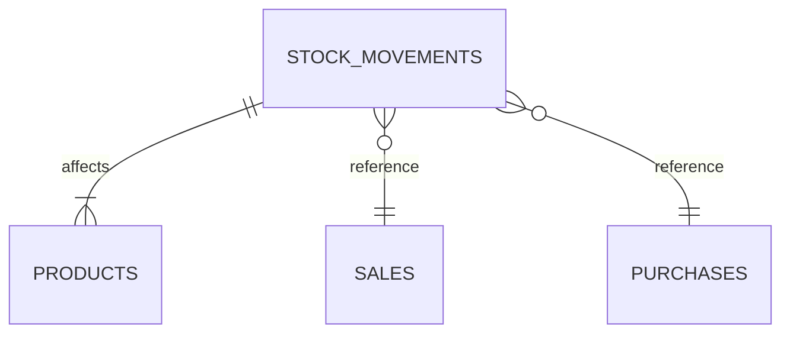

# Módulo Movimentações de Estoque - Especificação Técnica

> **Criado em 18/06/2025** – Documento inicial do submódulo de Movimentações.

## Objetivo

Registrar toda alteração de estoque (entradas, saídas, transferências, ajustes) garantindo rastreabilidade completa e integridade dos saldos.

## Requisitos Funcionais

1. **Tipos de Movimentação**
   - `purchase_in`  – Entrada por compra de fornecedor
   - `sale_out`     – Saída por venda
   - `transfer_in`  – Entrada por transferência
   - `transfer_out` – Saída por transferência
   - `adjustment`   – Ajuste manual (positivo/negativo)

2. **Tabelas**
   - `inventory_movements`
     | campo | tipo | descrição |
     |-------|------|-----------|
     | id | uuid | PK |
     | product_id | uuid | FK products |
     | type | text | Tipo (enum: `in`, `out`, `devolucao`, `fiado`) |
     | quantity | numeric | Quantidade (+/-) |
     | previous_stock | numeric | Stock antes da operação |
     | new_stock | numeric | Stock depois |
     | lot_code | text | Opcional – lote afetado |
     | reference_id | uuid | ID da venda/compra/ajuste |
     | created_at | timestamptz | Timestamp |

3. **Triggers**
   - `trg_adjust_inventory` AFTER INSERT em `inventory_movements` chama função `adjust_product_stock` que garante consistência (`stock_quantity` atualizado)
   - Atualizar `products.stock` e `batches.quantity` quando aplicável

4. **API / Hooks**
   - `useCreateMovement()` – Upsert na tabela
   - `useMovements({ productId, dateRange, type })` – Listagem filtrada

## Fluxo de Dados

## Casos de Uso

1. **Venda**
   - Cart chama `useCreateMovement` com `sale_out`, `quantity` negativa.
2. **Compra de fornecedor**
   - Tela de Recebimento registra `purchase_in` positiva.
3. **Ajuste de inventário**
   - Usuário admin informa diferença física, gera `adjustment`.

## Orientações de Implementação

- Todas operações devem ocorrer dentro de transação para manter atomicidade.
- Expor função SQL segura `fn_move_stock` utilizada pelos hooks.
- Garantir que UI mostre stock em tempo real via Supabase Realtime.
- Adicionar testes PGTap validando que stock nunca fica negativo.

## Métricas e Observabilidade

- Dashboard deverá exibir:
  - Movimentações diárias
  - Ajustes manuais por usuário
  - Produtos com maior giro
- Logs em `logs.stock` agrupados por `type` e gravidade.

## Atualizações

- **2025-06-18 22:41**: Renomeado para `inventory_movements` e alinhado tipos e trigger `trg_adjust_stock`.

- **18/06/2025**: Documento criado com modelo de dados, gatilhos e fluxo inicial.
