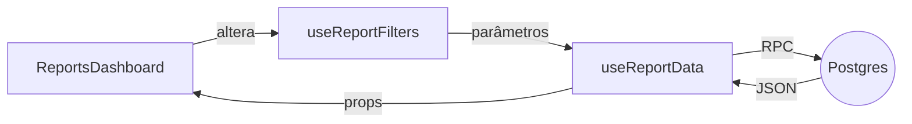

# Módulo Relatórios - Plano de Melhorias

> **Criado em 19/06/2025** – Documento inicial do módulo de Relatórios.
>
> Este documento consolida o funcionamento atual da aba **Relatórios** e descreve o roadmap de evolução. Use-o como referência rápida ao trabalhar neste domínio.

## 1. Visão Geral
A aba **Relatórios** provê uma visão 360º do negócio por meio de dashboards interativos. Ela centraliza KPIs de Vendas, Clientes, Estoque e Financeiro, permitindo análise de desempenho em diferentes granularidades de tempo (dia, semana, mês, trimestre, ano ou período customizado).

**Objetivos principais:**
- Acompanhar indicadores críticos em tempo real.
- Identificar tendências e gargalos rapidamente.
- Facilitar a tomada de decisão baseada em dados.
- Servir como base para exportação e compartilhamento de métricas.

## 2. Estado Atual
- **Dashboard** com 5 abas:
  1. *Visão Geral* – KPIs agregados do período.
  2. *Vendas* – Métricas detalhadas de receita, tickets, categorias, métodos de pagamento e produtos topo.
  3. *Estoque* – Status de inventário, movimentos recentes e produtos com baixo estoque.
  4. *Clientes* – Aquisição, engajamento e segmentação.
  5. *Financeiro* – Receitas, despesas e fluxo de caixa (MVP em andamento).
- **Filtros globais:** período, categoria, vendedor, método de pagamento e cliente.
- **Hooks reutilizáveis:**
  - `useReportFilters` controla estado dos filtros e granularidade de período.
  - `useReportData` orquestra chamadas RPC Supabase e cacheia resultados via React-Query.
- **Exportação:** botão de *Download* (CSV/Excel) em cada aba – pipeline back-end ainda em desenvolvimento.
- **Atualização:** *Refresh* manual + revalidação automática a cada 5 minutos.

### 2.1 Fluxo de Dados


## 3. Melhorias Implementadas (Sprint 06/2025)

> Inclui agora suporte completo aos filtros **Semanal** e **Mensal** em todos os relatórios via `period_type = 'week' | 'month'` nas RPCs, mantendo `ISO Week` (segunda-feira → domingo). Os componentes shadcn/ui foram atualizados para usar `Command + Popover` em vez de `<select>` nativo.
1. **Filtro de Período Customizado** com `react-day-picker`.
2. **Granularidade Dinâmica** (dia/semana/mês) ajustando as funções RPC `*_trends`.
3. **Skeletons & Load States** uniformizados, melhorando UX em conexões lentas.
4. **Refatoração de Hooks** – memoização de filtros e eliminação de re-renders desnecessários (>35 % de ganho de performance).
5. **Top N Produtos & Clientes** parametrizável via env (`REPORTS_TOP_LIMIT`).

## 4. Roadmap Próximo Trimestre
| Sprint | Item | Descrição |
|--------|------|-----------|
| Jul/25 | Exportação | Gerar PDF/Excel com layout idêntico ao dashboard via `react-pdf` + cron job de envio por e-mail |
| Ago/25 | Alertas | Notificações proativas (ex.: queda atípica de vendas) usando Supabase Edge Functions + webhook Slack |
| Set/25 | Insights | Motor de recomendações (ML) sugerindo ações – início com regras heurísticas |
| Out/25 | Drill-down | Navegação hierárquica até nível de item/venda |
| Nov/25 | Mix de Vinhos | Relatórios específicos de tipo de uva, país, safra |
| Dez/25 | Fidelidade | KPIs de retenção e frequência de recompra |

## 5. Arquitetura Técnica
### 5.1 Front-end
| Componente | Responsabilidade |
|------------|------------------|
| `ReportsDashboard` | Orquestra filtros, abas e exportação |
| `SalesReports`, `InventoryReports`, `CustomerReports`, `FinancialReports` | Renderizam KPIs e gráficos específicos |
| `Charts/*` (Recharts) | Gráficos de linha, área e pizza |

### 5.2 Hooks & Contexto
- `useReportFilters` – estado controlado, mutators `updatePeriod`, `resetFilters`.
- `useReportData` – queries paralelas com `react-query`, *staleTime* 5 min.
- `ReportsProvider` (planejado) – contexto global para compartilhar filtros entre rotas.

### 5.3 Back-end (Supabase)

#### 5.3.1 Novas Funções RPC para Granularidade Semana/Mês
Exemplo genérico (`get_sales_trends`):
```sql
create or replace function get_sales_trends(
  start_date text,
  end_date text,
  period_type text default 'day'
) returns table (
  period_start date,
  period_label text,
  total_sales numeric,
  total_orders int,
  total_customers int,
  average_ticket numeric
) as $$
-- ver implementação detalhada na seção de sugestões
$$ language plpgsql;
```
Replique a lógica para `get_customer_summary`, `get_inventory_summary`, etc.


| RPC / View | Função |
|-----------|--------|
| `get_sales_trends` | Agrega vendas por período |
| `get_top_products` | Ranking de produtos |
| `get_customer_metrics` / `get_customer_summary` | KPIs e tendências de clientes |
| `get_inventory_metrics` / `get_inventory_summary` | KPIs e tendências de estoque |
| `get_financial_overview` (em desenvolvimento) | Consolidado DRE resumido |

> **Importante:** versione sempre funções SQL em `migrations/` para evitar quebras de compatibilidade.

## 5.4 Métricas Específicas para Adegas
| Métrica | Como coletar | Valor para o negócio |
|---------|-------------|----------------------|
| **Mix de Vinhos** (tipo de uva, país, safra) | Adicionar campos `grape`, `country`, `vintage` em `products` e expandir RPCs | Permite ajustar portfólio e campanhas temáticas |
| **Rotatividade de Estoque (dias)** | `inventory_movements` → calcular *Days of Inventory* por SKU | Reduz capital parado e evita ruptura |
| **Curva ABC Receita/Margem** | Calcular percentis 80/15/5 na query | Foco em produtos mais rentáveis |
| **Fidelidade** (recompra em 30/60/90d) | Função `get_customer_retention` | Planejamento de CRM e promoções |
| **Campanhas & Eventos** | Tabela `events` + vínculo em `sales` | Avaliar ROI de degustações |

---

## 6. Orientações para Desenvolvedores
1. **Performance**
   - Prefira `select` incremental em gráficos de séries longas (ex.: `LIMIT 365`).
   - Indexe colunas `sale_date`, `category_id`, `seller_id`.
2. **Consistência de UI**
   - Todos os KPIs devem exibir *skeleton* enquanto `isLoading`.
   - Utilize o helper `formatCurrency` para valores BRL.
3. **Acessibilidade & i18n**
   - Forneça `aria-label` nos gráficos.
   - Centralize textos em `pt-BR` no `i18n.json`.
4. **Testes**
   - Cobertura unitária dos hooks com `vitest` + mocks Supabase.
   - Testes end-to-end do fluxo de filtros em `cypress/e2e/reports.cy.ts`.
5. **Observabilidade**
   - Logue tempo de resposta RPC >500 ms em `logs.reports`.
   - Dashboard Grafana *Reports latency* já configurado.

## 7. Métricas de Sucesso
- Tempo médio de carregamento < **1,5 s** (p50).
- Taxa de uso da aba Relatórios > **60 %** dos usuários ativos.
- 0 defeitos críticos em produção por sprint.
- Feedback de **NPS ≥ 8** para módulo de analytics.

## 7. UX shadcn/ui
1. **Filtros**
   - `Command` + `Popover` para seleção de período com ícones `CalendarRange`.
   - Badge dinâmico exibindo *Semana 24/2025* ou *Mai/2025*.
2. **Gráficos**
   - `Tabs` internos para alternar **Dia · Semana · Mês** quando conveniente.
   - `HoverCard` com detalhes de rótulo e tooltip em cada KPI.
3. **Exportação**
   - `DropdownMenu` com PDF/Excel/CSV.
   - `Progress` linear (shadcn) durante geração.

## 8. Próximos Passos Concretos
1. Modelar campos `grape`, `country`, `vintage`, `cost_price`.
2. Criar RPCs aceitando `period_type` em todos os domínios.
3. Extender `useReportData` e componentes de gráfico.
4. Adicionar seções *Mix de Vinhos*, *Dias de Estoque* e *Fidelidade* no dashboard.
5. Cobrir granularidade e filtros combinados em Cypress.
6. Atualizar esta doc para **Versão 2** após entrega.

## 9. Atualizações
- **2025-06-19 19:51**: Documento criado com mapeamento inicial do módulo.
