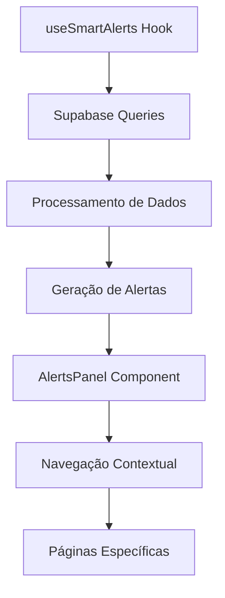

# Sistema de Alertas Inteligentes - Adega Manager

## 📋 Visão Geral

O Sistema de Alertas Inteligentes do Adega Manager é uma funcionalidade enterprise que monitora automaticamente dados críticos do sistema e gera alertas baseados em condições predefinidas. Todos os alertas são gerados a partir de **dados reais** do banco de dados Supabase, garantindo precisão e relevância.

## 🏗️ Arquitetura do Sistema

### Componentes Principais

```
src/features/dashboard/
├── hooks/
│   └── useSmartAlerts.ts          # Hook principal de geração de alertas
├── components/
│   └── AlertsPanel.tsx            # Componente de exibição dos alertas
└── types/
    └── Alert.ts                   # Interfaces TypeScript
```

### Fluxo de Dados



## 🎯 Tipos de Alertas Implementados

### 1. **Alertas de Estoque** 
**Severidade:** CRITICAL / WARNING

#### 🔴 Produtos sem Estoque (CRITICAL)
- **Condição:** `stock_quantity = 0`
- **Query:** `get_low_stock_products` RPC
- **Navegação:** `/inventory?filter=zero-stock`
- **Formato:** `{count} produto(s) sem estoque`

#### 🟡 Produtos Abaixo do Mínimo (WARNING)
- **Condição:** `stock_quantity > 0 AND stock_quantity <= min_stock`
- **Query:** `get_low_stock_products` RPC
- **Navegação:** `/inventory?filter=low-stock`
- **Formato:** `{count} produto(s) abaixo do mínimo`

### 2. **Alertas Financeiros**
**Severidade:** WARNING / INFO

#### 💰 Contas em Atraso +30 Dias (WARNING)
- **Condição:** `due_date < (CURRENT_DATE - INTERVAL '30 days')`
- **Tabela:** `accounts_receivable`
- **Navegação:** `/reports?tab=financial&filter=overdue-30`
- **Formato:** `R$ {valor} em atraso +30 dias`

#### 📅 Contas em Atraso Recente (INFO)
- **Condição:** `due_date < CURRENT_DATE`
- **Tabela:** `accounts_receivable`
- **Navegação:** `/reports?tab=financial&filter=overdue`
- **Formato:** `R$ {valor} em atraso recente`

### 3. **Alertas de CRM**
**Severidade:** INFO

#### 👥 Clientes Inativos (INFO)
- **Condição:** `last_purchase < (CURRENT_DATE - INTERVAL '60 days') OR last_purchase IS NULL`
- **Tabela:** `customers`
- **Navegação:** `/customers?filter=inactive-60d`
- **Formato:** `{count} cliente(s) inativo(s)`

### 4. **Alertas de Inventário**
**Severidade:** INFO

#### 📦 Produtos sem Giro (INFO)
- **Condição:** `price > 50 AND stock > 0 AND no sales in last 30 days`
- **Tabelas:** `products`, `sales`, `sale_items`
- **Navegação:** `/inventory?filter=dead-stock`
- **Formato:** `{count} produto(s) sem giro`

## 📊 Interface Alert

```typescript
export interface Alert {
  id: string;                    // Identificador único
  severity: 'info' | 'warning' | 'critical';
  title: string;                 // Título principal do alerta
  description?: string;          // Descrição adicional
  href?: string;                 // URL de navegação
  count?: number;                // Contador de itens afetados
  icon?: string;                 // Emoji/ícone visual
}

export interface AlertsData {
  alerts: Alert[];               // Array de alertas
  criticalCount: number;         // Contador de alertas críticos
  warningCount: number;          // Contador de alertas de atenção
  infoCount: number;             // Contador de alertas informativos
  inventoryTotalValue?: number;  // Valor total do estoque
}
```

## 🔧 Hook useSmartAlerts

### Configuração de Cache
```typescript
queryKey: ['smart-alerts']
staleTime: 5 * 60 * 1000       // 5 minutos
refetchInterval: 5 * 60 * 1000  // Auto refresh a cada 5 minutos
retry: 2
retryDelay: exponential backoff
```

### Queries Principais

#### 1. Low Stock Products
```sql
-- RPC: get_low_stock_products
SELECT id, name, stock_quantity, min_stock
FROM products 
WHERE stock_quantity <= min_stock OR stock_quantity = 0
ORDER BY stock_quantity ASC
LIMIT 50
```

#### 2. Accounts Receivable
```sql
SELECT ar.*, c.name as customer_name
FROM accounts_receivable ar
INNER JOIN customers c ON ar.customer_id = c.id
WHERE ar.status = 'open' 
  AND ar.due_date < CURRENT_DATE
ORDER BY ar.due_date ASC
```

#### 3. Inactive Customers
```sql
SELECT id, name, last_purchase
FROM customers
WHERE (last_purchase < CURRENT_DATE - INTERVAL '60 days' 
       OR last_purchase IS NULL)
  AND is_active = true
LIMIT 100
```

#### 4. Dead Stock Analysis
```sql
SELECT p.id, p.name, p.price, p.stock_quantity
FROM products p
LEFT JOIN sale_items si ON p.id = si.product_id
LEFT JOIN sales s ON si.sale_id = s.id 
  AND s.created_at > CURRENT_DATE - INTERVAL '30 days'
WHERE p.price > 50 
  AND p.stock_quantity > 0 
  AND s.id IS NULL
```

## 🎨 Componente AlertsPanel

### Configuração Visual

```typescript
const severityConfig = {
  critical: {
    color: 'text-red-400',
    bgColor: 'bg-red-500/10',
    borderColor: 'border-red-500/30',
    icon: XCircle
  },
  warning: {
    color: 'text-amber-400',
    bgColor: 'bg-amber-500/10',
    borderColor: 'border-amber-500/30',
    icon: AlertTriangle
  },
  info: {
    color: 'text-blue-400',
    bgColor: 'bg-blue-500/10',
    borderColor: 'border-blue-500/30',
    icon: Info
  }
};
```

### Props Interface
```typescript
interface AlertsPanelProps {
  items?: AlertItem[];           // Legacy support
  className?: string;
  maxItems?: number;             // Default: 6
  previewActivities?: RecentActivity[];
  cardHeight?: number;           // Para alinhamento
}
```

## 🔄 Sistema de Navegação

### Padrão de URLs

| Tipo de Alerta | URL Pattern | Parâmetros Suportados |
|----------------|-------------|----------------------|
| Estoque | `/inventory?filter={filter}` | `zero-stock`, `low-stock`, `dead-stock` |
| Financeiro | `/reports?tab=financial&filter={filter}` | `overdue-30`, `overdue` |
| CRM | `/customers?filter={filter}` | `inactive-60d` |
| Geral | `/reports?tab={tab}&period={days}` | `sales`, `inventory`, `crm`, `financial` |

### Implementação de Filtros

#### FinancialReportsSection
```typescript
// Leitura de parâmetros URL
useEffect(() => {
  const searchParams = new URLSearchParams(location.search);
  const filterParam = searchParams.get('filter');
  
  if (filterParam && ['overdue-30', 'overdue', 'all'].includes(filterParam)) {
    setActiveFilter(filterParam);
  }
}, [location.search]);

// Query com filtros
const { data: accountsReceivable } = useQuery({
  queryKey: ['accounts-receivable', activeFilter],
  queryFn: async () => {
    // Aplicar filtros baseados no activeFilter
    if (activeFilter === 'overdue-30') {
      return processedData.filter(item => item.days_overdue > 30);
    }
    return processedData;
  }
});
```

## 📈 Métricas e Monitoramento

### Contadores por Severidade
```typescript
const criticalCount = alerts.filter(a => a.severity === 'critical').length;
const warningCount = alerts.filter(a => a.severity === 'warning').length;
const infoCount = alerts.filter(a => a.severity === 'info').length;
```

### Ordenação por Prioridade
```typescript
const severityOrder = { critical: 0, warning: 1, info: 2 };
alerts.sort((a, b) => severityOrder[a.severity] - severityOrder[b.severity]);
```

## 🛠️ Guia para Implementação de Novos Alertas

### 1. Definir Critérios do Alerta
- **Severidade:** critical | warning | info
- **Condição SQL:** Query específica
- **Navegação:** URL de destino
- **Threshold:** Valores mínimos para triggering

### 2. Adicionar Query no useSmartAlerts
```typescript
// Template para novo alerta
try {
  const { data: newAlertData, error } = await supabase
    .from('table_name')
    .select('required_fields')
    .condition_filters();

  if (!error && newAlertData && newAlertData.length > threshold) {
    alerts.push({
      id: 'unique-alert-id',
      severity: 'warning', // ou 'critical' | 'info'
      title: `${newAlertData.length} items need attention`,
      description: 'Detailed description',
      href: '/destination?filter=alert-filter',
      count: newAlertData.length,
      icon: '🚨'
    });
  }
} catch (error) {
  console.error('Error fetching new alert:', error);
}
```

### 3. Implementar Navegação
- Adicionar suporte a filtros na página destino
- Implementar leitura de parâmetros URL
- Atualizar queries para aplicar filtros

### 4. Testar Completamente
- Verificar queries SQL
- Testar navegação
- Validar filtros
- Confirmar performance

## 🔒 Segurança e Validação

### Validação de Filtros
```typescript
// Whitelist de filtros válidos
const validFilters = {
  inventory: ['zero-stock', 'low-stock', 'dead-stock'],
  financial: ['overdue-30', 'overdue', 'all'],
  customers: ['inactive-60d', 'active-30d'],
  reports: ['sales', 'inventory', 'crm', 'financial']
};

// Validação antes de aplicar
if (filterParam && validFilters[section].includes(filterParam)) {
  setActiveFilter(filterParam);
}
```

### RLS Policies
Todos os alertas respeitam as Row Level Security policies do Supabase:
- **Admin:** Acesso a todos os alertas
- **Employee:** Alertas operacionais (exceto financeiros sensíveis)
- **Delivery:** Alertas relacionados apenas a entregas

## ⚡ Performance e Otimização

### Cache Strategy
- **Smart Alerts:** 5 minutos de cache
- **Individual Queries:** Cache específico por tipo
- **Background Refresh:** Automático sem bloquear UI

### Lazy Loading
```typescript
// Carregamento sob demanda
const { data, isLoading } = useSmartAlerts();

// Hooks específicos para casos de uso
export function useLowStockAlerts() {
  const { data } = useSmartAlerts();
  return data?.alerts.filter(alert => 
    alert.id === 'low-stock' || alert.id === 'zero-stock'
  ) || [];
}
```

## 📝 Changelog

### v1.0.0 - Sistema Base
- ✅ Alertas de estoque (zero e baixo)
- ✅ Alertas financeiros (contas em atraso)
- ✅ Alertas de CRM (clientes inativos)
- ✅ Navegação contextual implementada
- ✅ Filtros por URL funcionais

### Próximas Implementações
- 🔄 Alertas de delivery em atraso
- 🔄 Alertas de vendas por meta
- 🔄 Alertas de produtos próximos ao vencimento
- 🔄 Notificações push para alertas críticos

## 🚨 Considerações Importantes

### Evitar Duplicações
1. **Verificar alertas existentes** antes de implementar novos
2. **Reutilizar queries RPC** quando possível
3. **Padronizar navegação** seguindo patterns estabelecidos
4. **Validar performance** de novas queries

### Boas Práticas
- Sempre usar dados reais do sistema
- Implementar cache adequado (5-15 minutos)
- Adicionar tratamento de erro
- Seguir padrões de severity estabelecidos
- Documentar novas queries SQL
- Testar com dados de produção

### Thresholds Recomendados
- **Critical:** Problemas que impedem operação
- **Warning:** Situações que precisam atenção
- **Info:** Monitoramento e insights

---

**Última atualização:** Agosto 2025  
**Versão do Sistema:** v2.0.0  
**Status:** Produção Ativa ✅

####EXEMPLOD DE USO ALERTA ATUAL:

Perfeito! Vejo a imagem do alerta no dashboard. Deixe-me explicar detalhadamente o que este alerta significa:

  🚨 Análise do Alerta Financeiro

  📋 Informações do Alerta:

  - Título: "R$ 2617,90 em atraso +30 dias"
  - Descrição: "6 contas em atraso"
  - Detalhes: "6 items"
  - Severidade: WARNING (ícone amarelo ⚠️)

  💡 Significado Detalhado:

  Este alerta indica que o sistema identificou uma situação financeira que requer atenção:

  1. 💰 Valor Total: R$ 2.617,90
    - Soma de todas as contas em atraso superior a 30 dias
    - Representa dinheiro que deveria ter sido recebido há mais de um mês
  2. 📅 Período de Atraso: +30 dias
    - Contas com vencimento superior a 30 dias corridos
    - Considerado atraso "crítico" para fluxo de caixa
  3. 📊 Quantidade: 6 contas
    - São 6 clientes diferentes em situação de inadimplência
    - Cada conta representa um cliente específico
  4. 🎯 Impacto no Negócio:
    - Fluxo de Caixa: Dinheiro que falta no caixa da empresa
    - Relacionamento: Clientes que precisam de cobrança
    - Gestão: Situação que requer ação imediata

  🔍 Como o Sistema Calcula Este Alerta:

  Baseado no código do useSmartAlerts.ts (linhas 82-97):

  -- Query executada pelo sistema:
  SELECT amount, due_date FROM accounts_receivable
  WHERE status = 'open'
    AND due_date < (CURRENT_DATE - INTERVAL '30 days')

  Processamento:
  1. Sistema busca na tabela accounts_receivable
  2. Filtra contas com status "open" (em aberto)
  3. Identifica contas vencidas há mais de 30 dias
  4. Soma os valores: R$ 2.617,90
  5. Conta os registros: 6 contas

  🎯 Ação Recomendada:

  Quando clicar neste alerta, o usuário será direcionado para:
  - URL: /reports?tab=financial&filter=overdue-30
  - Destino: Aba "Financeiro & Fluxo" dos relatórios
  - Visualização: Tabela filtrada mostrando apenas essas 6 contas específicas

  O que o usuário verá:
  - Lista detalhada dos 6 clientes inadimplentes
  - Valores individuais de cada conta
  - Datas de vencimento específicas
  - Quantos dias cada conta está em atraso
  - Opções para ação (cobrança, contato, etc.)

  📈 Contexto Empresarial:

  Para uma empresa com R$ 165.700,00 em estoque:
  - R$ 2.617,90 representa ~1,6% do valor total
  - 6 contas sugerem problema recorrente de cobrança
  - Situação administrável, mas que requer atenção

  🚨 Níveis de Gravidade:

  - 🟢 Normal: Contas em dia
  - 🟡 Atenção: 1-30 dias de atraso
  - 🟠 WARNING: +30 dias (atual) ⚠️
  - 🔴 CRITICAL: +90 dias

  Este alerta está em nível WARNING porque indica uma situação que precisa de ação, mas não é uma emergência crítica para o negócio.

  O sistema está funcionando corretamente ao detectar e alertar sobre essa situação financeira que requer gestão ativa! 📊