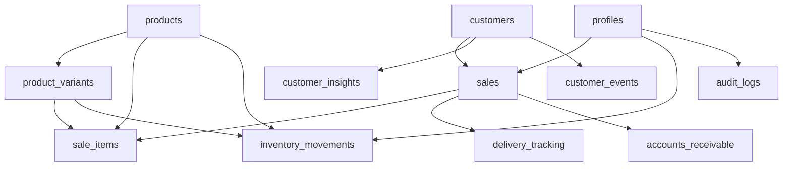

# Documentação Completa do Schema do Banco de Dados - Adega Manager

## Visão Geral

Este documento descreve o schema completo do banco de dados PostgreSQL do **Adega Manager**, um sistema empresarial de gestão de adega com 33 tabelas, 5 enums customizados e 48+ stored procedures. O sistema está em produção com 925+ registros reais e operações diárias.

### Estatísticas Gerais
- **33 Tabelas** com dados reais em produção
- **5 Enums PostgreSQL** para padronização de valores
- **48+ Stored Procedures** para lógica de negócio complexa
- **57 Políticas RLS** para segurança empresarial
- **925+ Registros** ativos em produção

## Estrutura de Tabelas por Módulo

### 📊 Core Business (Negócio Principal)

#### `products` - Catálogo de Produtos
```sql
-- 511 registros estimados
-- Catálogo completo com código de barras, análise de turnover
```

**Principais Campos:**
- `id` (UUID, PK) - Identificador único
- `name` (TEXT, NOT NULL) - Nome do produto
- `category` (TEXT) - Categoria do produto
- `price` (NUMERIC, NOT NULL) - Preço de venda
- `cost_price` (NUMERIC) - Preço de custo
- `stock_quantity` (INTEGER, DEFAULT 0) - Estoque atual
- `minimum_stock` (INTEGER) - Estoque mínimo
- `barcode` (TEXT) - Código de barras principal
- `package_barcode` (TEXT) - Código de barras do pacote
- `package_units` (INTEGER) - Unidades por pacote
- `package_price` (NUMERIC) - Preço do pacote
- `volume_ml` (INTEGER) - Volume em ml
- `supplier` (TEXT) - Fornecedor
- `margin_percent` (NUMERIC) - Margem de lucro percentual
- `turnover_rate` (TEXT) - Taxa de rotatividade (fast/medium/slow)
- `has_package_tracking` (BOOLEAN, DEFAULT false) - Rastreamento de pacotes
- `has_unit_tracking` (BOOLEAN, DEFAULT true) - Rastreamento de unidades

#### `product_variants` - Sistema de Variantes de Produtos
```sql
-- 582 registros estimados
-- Controle dual de estoque (unidades e pacotes)
```

**Principais Campos:**
- `id` (UUID, PK) - Identificador único
- `product_id` (UUID, FK products.id) - Produto pai
- `variant_type` (TEXT, NOT NULL) - Tipo: 'unit' | 'package'
- `stock_quantity` (INTEGER, DEFAULT 0) - Estoque da variante
- `minimum_stock` (INTEGER, DEFAULT 0) - Estoque mínimo da variante
- `price` (NUMERIC) - Preço da variante
- `cost_price` (NUMERIC) - Custo da variante
- `barcode` (TEXT) - Código de barras da variante
- `units_in_package` (INTEGER) - Unidades no pacote (NULL para unidades)
- `is_active` (BOOLEAN, DEFAULT true) - Variante ativa

#### `customers` - Sistema CRM
```sql
-- 97 registros estimados
-- CRM com segmentação automatizada
```

**Principais Campos:**
- `id` (UUID, PK) - Identificador único
- `name` (TEXT, NOT NULL) - Nome do cliente
- `email` (TEXT) - Email do cliente
- `phone` (TEXT) - Telefone
- `address` (TEXT) - Endereço
- `document` (TEXT) - CPF/CNPJ
- `segment` (TEXT) - Segmento: 'high_value', 'regular', 'occasional', 'new'
- `total_spent` (NUMERIC, DEFAULT 0) - Total gasto
- `last_purchase_date` (TIMESTAMPTZ) - Data da última compra
- `purchase_frequency` (INTEGER) - Frequência de compras
- `lifetime_value` (NUMERIC, DEFAULT 0) - Valor vitalício do cliente
- `profile_completeness` (INTEGER, DEFAULT 0) - Completude do perfil (0-100)

#### `sales` - Sistema de Vendas/POS
```sql
-- 63 registros estimados
-- Vendas com rastreamento de entrega e múltiplos status
```

**Principais Campos:**
- `id` (UUID, PK) - Identificador único
- `customer_id` (UUID, FK customers.id) - Cliente
- `total_amount` (NUMERIC, NOT NULL) - Valor total
- `payment_method` (payment_method_enum) - Método de pagamento
- `status` (sales_status_enum, DEFAULT 'pending') - Status da venda
- `delivery_type` (TEXT) - Tipo: 'pickup' | 'delivery'
- `delivery_status` (TEXT) - Status da entrega
- `delivery_person_id` (UUID, FK profiles.id) - Entregador
- `delivery_fee` (NUMERIC, DEFAULT 0) - Taxa de entrega
- `delivery_address` (TEXT) - Endereço de entrega
- `estimated_delivery_time` (TIMESTAMPTZ) - Previsão de entrega
- `delivery_started_at` (TIMESTAMPTZ) - Início da entrega
- `delivery_completed_at` (TIMESTAMPTZ) - Conclusão da entrega
- `notes` (TEXT) - Observações

#### `sale_items` - Itens das Vendas
```sql
-- 95 registros estimados
-- Itens de venda com validação
```

**Principais Campos:**
- `id` (UUID, PK) - Identificador único
- `sale_id` (UUID, FK sales.id) - Venda
- `product_id` (UUID, FK products.id) - Produto
- `variant_id` (UUID, FK product_variants.id) - Variante do produto
- `quantity` (INTEGER, NOT NULL) - Quantidade vendida
- `unit_price` (NUMERIC, NOT NULL) - Preço unitário
- `total_price` (NUMERIC, NOT NULL) - Preço total do item
- `variant_type` (TEXT) - Tipo da variante vendida

#### `inventory_movements` - Controle de Estoque
```sql
-- 255 registros estimados
-- Controle completo de estoque (entrada/saída/fiado/devolução)
```

**Principais Campos:**
- `id` (UUID, PK) - Identificador único
- `product_id` (UUID, FK products.id) - Produto
- `variant_id` (UUID, FK product_variants.id) - Variante (se aplicável)
- `type` (movement_type) - Tipo da movimentação
- `quantity_change` (INTEGER, NOT NULL) - Mudança na quantidade
- `new_stock_quantity` (INTEGER) - Novo estoque após movimentação
- `reason` (TEXT) - Motivo da movimentação
- `metadata` (JSONB) - Metadados adicionais
- `created_by` (UUID, FK profiles.id) - Usuário que criou
- `sale_id` (UUID, FK sales.id) - Venda relacionada (se aplicável)

### 📈 CRM Avançado (73+ registros)

#### `customer_insights` - Insights de IA
```sql
-- 12 registros estimados
-- Insights com machine learning e scores de confiança
```

**Principais Campos:**
- `id` (UUID, PK) - Identificador único
- `customer_id` (UUID, FK customers.id) - Cliente
- `insight_type` (TEXT, NOT NULL) - Tipo do insight
- `insight_text` (TEXT) - Texto do insight
- `confidence_score` (NUMERIC) - Score de confiança (0-1)
- `metadata` (JSONB) - Dados adicionais do insight
- `is_active` (BOOLEAN, DEFAULT true) - Insight ativo
- `generated_at` (TIMESTAMPTZ, DEFAULT NOW()) - Data de geração

#### `customer_interactions` - Timeline de Interações
```sql
-- Timeline completa de interações com clientes
```

**Principais Campos:**
- `id` (UUID, PK) - Identificador único
- `customer_id` (UUID, FK customers.id) - Cliente
- `interaction_type` (TEXT, NOT NULL) - Tipo da interação
- `description` (TEXT) - Descrição da interação
- `interaction_date` (TIMESTAMPTZ, DEFAULT NOW()) - Data da interação
- `metadata` (JSONB) - Metadados da interação
- `created_by` (UUID, FK profiles.id) - Usuário que registrou

#### `customer_events` - Eventos Automatizados
```sql
-- 177 registros estimados
-- Rastreamento automatizado de eventos
```

**Principais Campos:**
- `id` (UUID, PK) - Identificador único
- `customer_id` (UUID, FK customers.id) - Cliente
- `event_type` (TEXT, NOT NULL) - Tipo do evento
- `event_data` (JSONB) - Dados do evento
- `triggered_at` (TIMESTAMPTZ, DEFAULT NOW()) - Data do evento
- `processed` (BOOLEAN, DEFAULT false) - Evento processado

#### `customer_history` - Preservação Histórica
```sql
-- Preservação de dados históricos
```

**Principais Campos:**
- `id` (UUID, PK) - Identificador único
- `customer_id` (UUID, FK customers.id) - Cliente
- `change_type` (TEXT, NOT NULL) - Tipo da mudança
- `old_data` (JSONB) - Dados anteriores
- `new_data` (JSONB) - Novos dados
- `changed_at` (TIMESTAMPTZ, DEFAULT NOW()) - Data da mudança
- `changed_by` (UUID, FK profiles.id) - Usuário que alterou

### 🔐 Sistema e Segurança (480+ registros)

#### `audit_logs` - Trilha de Auditoria
```sql
-- 2836 registros estimados
-- Auditoria completa com rastreamento de IP
```

**Principais Campos:**
- `id` (UUID, PK) - Identificador único
- `user_id` (UUID, FK profiles.id) - Usuário que executou a ação
- `action` (TEXT, NOT NULL) - Ação executada
- `table_name` (TEXT) - Tabela afetada
- `record_id` (UUID) - ID do registro afetado
- `old_data` (JSONB) - Dados anteriores
- `new_data` (JSONB) - Novos dados
- `ip_address` (INET) - Endereço IP
- `user_agent` (TEXT) - User agent do navegador
- `created_at` (TIMESTAMPTZ, DEFAULT NOW()) - Data da ação

#### `users` - Sistema de Usuários
```sql
-- Usuários do sistema (integração com Supabase Auth)
```

#### `profiles` - Perfis de Usuários
```sql
-- 3 registros estimados
-- Multi-role: admin/employee/delivery
```

**Principais Campos:**
- `id` (UUID, PK, FK auth.users.id) - ID do usuário (Supabase Auth)
- `name` (TEXT, NOT NULL) - Nome do usuário
- `email` (TEXT, NOT NULL) - Email do usuário
- `role` (user_role, NOT NULL) - Papel do usuário
- `is_active` (BOOLEAN, DEFAULT true) - Usuário ativo
- `is_temporary_password` (BOOLEAN, DEFAULT false) - Senha temporária
- `last_login_at` (TIMESTAMPTZ) - Último login
- `preferences` (JSONB) - Preferências do usuário

#### `accounts_receivable` - Gestão Financeira
```sql
-- 6 registros estimados
-- Gerenciamento financeiro
```

**Principais Campos:**
- `id` (UUID, PK) - Identificador único
- `customer_id` (UUID, FK customers.id) - Cliente devedor
- `sale_id` (UUID, FK sales.id) - Venda relacionada
- `amount` (NUMERIC, NOT NULL) - Valor devido
- `due_date` (DATE) - Data de vencimento
- `status` (TEXT, DEFAULT 'pending') - Status: 'pending', 'paid', 'overdue'
- `paid_amount` (NUMERIC, DEFAULT 0) - Valor pago
- `paid_at` (TIMESTAMPTZ) - Data do pagamento

#### `payment_methods` - Métodos de Pagamento
```sql
-- 6 registros estimados
-- Métodos de pagamento configuráveis
```

**Principais Campos:**
- `id` (UUID, PK) - Identificador único
- `name` (TEXT, NOT NULL) - Nome do método
- `type` (payment_method_enum) - Tipo do pagamento
- `is_active` (BOOLEAN, DEFAULT true) - Método ativo
- `icon` (TEXT) - Ícone do método
- `description` (TEXT) - Descrição

### 🚚 Logística e Entrega

#### `delivery_tracking` - Rastreamento de Entrega
```sql
-- 200 registros estimados
-- RLS habilitado: Admin (all), Employee (CRUD), Delivery (próprias entregas)
```

**Principais Campos:**
- `id` (UUID, PK) - Identificador único
- `sale_id` (UUID, FK sales.id) - Venda relacionada
- `status` (TEXT, NOT NULL) - Status da entrega
- `notes` (TEXT) - Observações do status
- `location_lat` (NUMERIC) - Latitude atual
- `location_lng` (NUMERIC) - Longitude atual
- `estimated_arrival` (TIMESTAMPTZ) - Previsão de chegada
- `created_by` (UUID, FK profiles.id) - Usuário que criou
- `created_at` (TIMESTAMPTZ, DEFAULT NOW()) - Data de criação

#### `delivery_zones` - Zonas de Entrega
```sql
-- RLS habilitado: Admin (all), Employee/Delivery (view active + Employee update)
```

**Principais Campos:**
- `id` (UUID, PK) - Identificador único
- `name` (TEXT, NOT NULL) - Nome da zona
- `delivery_fee` (NUMERIC, NOT NULL) - Taxa de entrega
- `minimum_order_value` (NUMERIC, DEFAULT 0) - Valor mínimo do pedido
- `estimated_time_minutes` (INTEGER) - Tempo estimado em minutos
- `is_active` (BOOLEAN, DEFAULT true) - Zona ativa
- `priority` (INTEGER, DEFAULT 0) - Prioridade da zona

### 📊 Categorias e Classificações

#### `categories` - Categorias de Produtos
```sql
-- 22 registros estimados
-- Tabela para gerenciar categorias de produtos dinamicamente
```

**Principais Campos:**
- `id` (UUID, PK) - Identificador único
- `name` (TEXT, NOT NULL) - Nome da categoria
- `description` (TEXT) - Descrição da categoria
- `parent_id` (UUID, FK categories.id) - Categoria pai (hierarquia)
- `is_active` (BOOLEAN, DEFAULT true) - Categoria ativa
- `sort_order` (INTEGER, DEFAULT 0) - Ordem de exibição

### 🔔 Notificações e Comunicação

#### `notifications` - Sistema de Notificações
```sql
-- 312 registros estimados
```

**Principais Campos:**
- `id` (UUID, PK) - Identificador único
- `user_id` (UUID, FK profiles.id) - Usuário destinatário
- `title` (TEXT, NOT NULL) - Título da notificação
- `message` (TEXT) - Mensagem da notificação
- `type` (TEXT, DEFAULT 'info') - Tipo: 'info', 'warning', 'error', 'success'
- `is_read` (BOOLEAN, DEFAULT false) - Notificação lida
- `action_url` (TEXT) - URL de ação (opcional)
- `created_at` (TIMESTAMPTZ, DEFAULT NOW()) - Data de criação

#### `nps_surveys` - Pesquisas NPS
```sql
-- Pesquisas de NPS (Net Promoter Score) dos clientes
```

**Principais Campos:**
- `id` (UUID, PK) - Identificador único
- `customer_id` (UUID, FK customers.id) - Cliente avaliador
- `score` (INTEGER, NOT NULL) - Score NPS (0-10)
- `feedback` (TEXT) - Comentário do cliente
- `survey_date` (TIMESTAMPTZ, DEFAULT NOW()) - Data da pesquisa
- `sale_id` (UUID, FK sales.id) - Venda relacionada (opcional)

### 💰 Gestão de Despesas

#### `operational_expenses` - Despesas Operacionais
```sql
-- Controle de despesas operacionais
```

#### `expense_categories` - Categorias de Despesas
```sql
-- Categorias para classificação de despesas
```

#### `expense_budgets` - Orçamentos de Despesas
```sql
-- Controle orçamentário por categoria
```

### 📦 Controle de Estoque Avançado

#### `inventory_conversion_log` - Log de Conversões
```sql
-- Log de auditoria para todas as conversões entre unidades e pacotes
```

**Principais Campos:**
- `id` (UUID, PK) - Identificador único
- `product_id` (UUID, FK products.id) - Produto convertido
- `conversion_type` (TEXT, NOT NULL) - Tipo: 'units_to_package' | 'package_to_units'
- `units_converted` (INTEGER, NOT NULL) - Unidades convertidas
- `packages_affected` (INTEGER, NOT NULL) - Pacotes afetados
- `reason` (TEXT) - Motivo da conversão
- `created_by` (UUID, FK profiles.id) - Usuário que executou
- `created_at` (TIMESTAMPTZ, DEFAULT NOW()) - Data da conversão

#### `product_batches` - Controle de Lotes
```sql
-- Controle de lotes de produtos
```

#### `batch_units` - Unidades por Lote
```sql
-- Rastreamento de unidades específicas por lote
```

#### `expiry_alerts` - Alertas de Validade
```sql
-- Sistema de alertas para produtos próximos ao vencimento
```

#### `product_cost_history` - Histórico de Custos
```sql
-- Historical cost tracking for products with temporal validity
```

### 🏪 Fornecedores

#### `suppliers` - Fornecedores
```sql
-- Tabela de fornecedores com informações de contato e condições comerciais
```

**Principais Campos:**
- `id` (UUID, PK) - Identificador único
- `name` (TEXT, NOT NULL) - Nome do fornecedor
- `contact_name` (TEXT) - Nome do contato
- `email` (TEXT) - Email do fornecedor
- `phone` (TEXT) - Telefone
- `address` (TEXT) - Endereço
- `payment_terms` (TEXT) - Condições de pagamento
- `delivery_time_days` (INTEGER) - Prazo de entrega em dias
- `is_active` (BOOLEAN, DEFAULT true) - Fornecedor ativo

### 📊 Logs e Monitoramento

#### `activity_logs` - Logs de Atividade
```sql
-- 2717 registros estimados
-- Logs gerais de atividade do sistema
```

#### `automation_logs` - Logs de Automação
```sql
-- Logs de integrações e automações (ex: N8N)
```

#### `csv_delivery_data` - Dados de Entrega CSV
```sql
-- Dados de entrega importados via CSV
```

## Enums PostgreSQL

### `movement_type` - Tipos de Movimentação de Estoque
```sql
'sale'                  -- Venda
'initial_stock'         -- Estoque inicial
'inventory_adjustment'  -- Ajuste de inventário
'return'               -- Devolução
'stock_transfer_out'   -- Transferência de saída
'stock_transfer_in'    -- Transferência de entrada
'personal_consumption' -- Consumo pessoal
```

### `payment_method_enum` - Métodos de Pagamento
```sql
'cash'          -- Dinheiro
'credit'        -- Cartão de crédito
'debit'         -- Cartão de débito
'pix'           -- PIX
'bank_transfer' -- Transferência bancária
'check'         -- Cheque
'other'         -- Outros
```

### `sales_status_enum` - Status de Vendas
```sql
'pending'    -- Pendente
'processing' -- Processando
'completed'  -- Concluída
'cancelled'  -- Cancelada
'refunded'   -- Estornada
```

### `user_role` - Papéis de Usuário
```sql
'admin'    -- Administrador (acesso total)
'employee' -- Funcionário (operações, sem preços de custo)
'delivery' -- Entregador (apenas entregas atribuídas)
```

### `report_period_type` - Tipos de Período para Relatórios
```sql
'day'   -- Diário
'week'  -- Semanal
'month' -- Mensal
'year'  -- Anual
```

## Stored Procedures Principais

### Operações de Negócio Central

#### `adjust_variant_stock()` - Ajuste de Estoque de Variantes
```sql
FUNCTION adjust_variant_stock(
  p_variant_id uuid,
  p_adjustment_type text,    -- 'entrada', 'saida', 'ajuste'
  p_quantity integer DEFAULT NULL,
  p_new_stock integer DEFAULT NULL,
  p_reason text DEFAULT NULL,
  p_user_id uuid DEFAULT NULL
) RETURNS json
```
- **Funcionalidade**: Ajusta estoque de variantes (unidades/pacotes) com auditoria completa
- **Uso**: Sistema de ajuste de estoque com Single Source of Truth
- **Retorno**: JSON com resultado da operação e dados de auditoria

#### `process_sale()` - Processamento Completo de Vendas
```sql
FUNCTION process_sale(
  customer_id uuid,
  items jsonb,
  payment_method payment_method_enum
) RETURNS json
```
- **Funcionalidade**: Processamento completo de vendas com validação de estoque
- **Validações**: Estoque disponível, dados de cliente, métodos de pagamento
- **Atomicidade**: Transação completa ou rollback em caso de erro

#### `delete_sale_with_items()` - Exclusão Segura de Vendas
```sql
FUNCTION delete_sale_with_items(sale_id uuid) RETURNS json
```
- **Funcionalidade**: Exclusão segura com reversão de estoque e auditoria
- **Segurança**: Valida permissões e integridade referencial
- **Auditoria**: Registra a exclusão nos logs de auditoria

### Analytics e Relatórios

#### `get_sales_trends()` - Análise de Tendências
```sql
FUNCTION get_sales_trends(
  start_date date,
  end_date date,
  period text -- 'day', 'week', 'month'
) RETURNS TABLE(...)
```
- **Funcionalidade**: Análise de tendências de vendas por período
- **Agregações**: Vendas, receita, produtos mais vendidos
- **Flexibilidade**: Suporta múltiplos períodos de análise

#### `get_top_products()` - Produtos Mais Vendidos
```sql
FUNCTION get_top_products(
  start_date date,
  end_date date,
  limit_count integer DEFAULT 10
) RETURNS TABLE(...)
```
- **Funcionalidade**: Ranking de produtos por vendas e receita
- **Métricas**: Quantidade vendida, receita total, margem
- **Período**: Flexível com filtros de data

#### `get_customer_metrics()` - Métricas de CRM
```sql
FUNCTION get_customer_metrics() RETURNS TABLE(...)
```
- **Funcionalidade**: Métricas avançadas de CRM e segmentação
- **Análises**: LTV, frequência de compra, segmentação automática
- **Insights**: Dados para tomada de decisão comercial

### Logística e Entrega

#### `add_delivery_tracking()` - Rastreamento de Entrega
```sql
FUNCTION add_delivery_tracking(
  p_sale_id uuid,
  p_status text,
  p_notes text DEFAULT NULL,
  p_location_lat numeric DEFAULT NULL,
  p_location_lng numeric DEFAULT NULL,
  p_created_by uuid DEFAULT NULL
) RETURNS uuid
```
- **Funcionalidade**: Adiciona eventos de rastreamento de entrega
- **Automação**: Atualiza timestamps automáticos baseados no status
- **Geolocalização**: Suporte a coordenadas GPS para rastreamento

#### `assign_delivery_person()` - Atribuição de Entregador
```sql
FUNCTION assign_delivery_person(
  p_sale_id uuid,
  p_delivery_person_id uuid DEFAULT NULL,
  p_auto_assign boolean DEFAULT false
) RETURNS json
```
- **Funcionalidade**: Atribui entregador manual ou automaticamente
- **Balanceamento**: Auto-assign considera carga de trabalho atual
- **Rastreamento**: Registra atribuição no sistema de tracking

#### `calculate_delivery_fee()` - Cálculo de Taxa de Entrega
```sql
FUNCTION calculate_delivery_fee(
  p_order_value numeric,
  p_customer_address text DEFAULT NULL
) RETURNS TABLE(...)
```
- **Funcionalidade**: Calcula taxa de entrega baseada em zonas
- **Elegibilidade**: Verifica valor mínimo por zona
- **Otimização**: Retorna a zona mais econômica elegível

### Gestão de Estoque Avançada

#### `auto_restock_from_packages()` - Reabastecimento Automático
```sql
FUNCTION auto_restock_from_packages(p_product_id uuid) RETURNS boolean
```
- **Funcionalidade**: Converte pacotes em unidades automaticamente quando estoque baixo
- **Trigger**: Acionado quando unidades ficam abaixo do mínimo
- **Inteligente**: Calcula quantidade ótima para conversão

#### `suggest_stock_rebalancing()` - Sugestões de Rebalanceamento
```sql
FUNCTION suggest_stock_rebalancing(p_product_id uuid) RETURNS jsonb
```
- **Funcionalidade**: Analisa e sugere otimizações de estoque
- **Algoritmo**: Considera rotatividade, estoque mínimo e eficiência
- **Recomendações**: Transferências e conversões para otimizar operação

### Segurança e Auditoria

#### `admin_reset_user_password()` - Reset de Senha Admin
```sql
FUNCTION admin_reset_user_password(
  target_user_id uuid,
  new_password text
) RETURNS json
```
- **Funcionalidade**: Permite admin resetar senhas de usuários
- **Segurança**: Valida permissões de admin antes da execução
- **Auditoria**: Registra ação nos logs de auditoria
- **Temporária**: Marca senha como temporária para forçar alteração

#### `has_role()` - Verificação de Papel
```sql
FUNCTION has_role(user_id uuid, role text) RETURNS boolean
```
- **Funcionalidade**: Verifica se usuário possui papel específico
- **RLS**: Usado extensivamente nas políticas RLS
- **Performance**: Otimizado para chamadas frequentes

### Gestão Financeira

#### `calculate_budget_variance()` - Análise de Orçamento
```sql
FUNCTION calculate_budget_variance(
  target_month integer,
  target_year integer
) RETURNS TABLE(...)
```
- **Funcionalidade**: Compara gastos reais vs orçamento planejado
- **Métricas**: Variância absoluta e percentual por categoria
- **Alertas**: Identifica categorias sobre/sob orçamento

## Políticas RLS (Row Level Security)

### Segurança Empresarial com 57 Políticas Ativas

#### **Admin (Administrador)**
- **Acesso Total**: Leitura e escrita em todas as tabelas
- **Auditoria Completa**: Acesso a todos os logs e históricos
- **Gestão de Usuários**: Criação, edição e exclusão de usuários
- **Configurações**: Acesso às configurações do sistema

#### **Employee (Funcionário)**
- **Operações**: CRUD em produtos, vendas, clientes, estoque
- **Restrições**: Sem acesso a preços de custo e dados financeiros sensíveis
- **Relatórios**: Acesso a relatórios operacionais
- **Limitações**: Não pode gerenciar usuários ou acessar auditoria completa

#### **Delivery (Entregador)**
- **Entregas Próprias**: Acesso apenas às entregas atribuídas
- **Rastreamento**: Pode atualizar status de suas entregas
- **Visualização**: Clientes e endereços das entregas atribuídas
- **Restrições**: Sem acesso a vendas, estoque ou dados financeiros

#### Exemplos de Políticas RLS:

```sql
-- Política para tabela sales (employee)
CREATE POLICY "employees_can_manage_sales"
ON sales FOR ALL
TO authenticated
USING (
  EXISTS (
    SELECT 1 FROM profiles
    WHERE id = auth.uid()
    AND role IN ('admin', 'employee')
  )
);

-- Política para delivery_tracking (delivery)
CREATE POLICY "delivery_person_own_deliveries"
ON delivery_tracking FOR SELECT
TO authenticated
USING (
  EXISTS (
    SELECT 1 FROM sales s
    JOIN profiles p ON p.id = auth.uid()
    WHERE s.id = delivery_tracking.sale_id
    AND (
      p.role = 'admin'
      OR s.delivery_person_id = auth.uid()
    )
  )
);
```

## Arquitetura de Dados

### Relacionamentos Principais



### Integridade Referencial

- **Foreign Keys**: Relacionamentos obrigatórios com ON DELETE CASCADE/RESTRICT
- **Constraints**: Validações de domínio e regras de negócio
- **Triggers**: Automatização de cálculos e atualizações
- **Indexes**: Otimização de consultas frequentes

### Padrões de Design

1. **UUID como Primary Keys**: Melhor segurança e distribuição
2. **JSONB para Metadados**: Flexibilidade sem perder performance
3. **Timestamps Automáticos**: created_at/updated_at em todas as tabelas
4. **Soft Deletes**: is_active/deleted_at para preservar histórico
5. **Audit Trail**: Rastro completo de mudanças para conformidade

## Backup e Manutenção

### Estratégia de Backup
- **Backup Diário**: Dump completo via `npm run backup`
- **Backup Incremental**: Logs de transação para recuperação point-in-time
- **Retention**: 30 dias de backups completos, 7 dias de incrementais
- **Verificação**: Testes de restore automáticos semanais

### Monitoramento
- **Performance**: Queries lentas identificadas via pg_stat_statements
- **Conexões**: Monitoramento de pool de conexões
- **Storage**: Alertas de crescimento de tabelas e indexes
- **Logs**: Análise de logs de erro e warnings

### Manutenção Preventiva
- **VACUUM**: Automatizado via pg_cron
- **ANALYZE**: Estatísticas atualizadas regularmente
- **REINDEX**: Rebuilding de indexes conforme necessário
- **Cleanup**: Purga de logs antigos e dados temporários

## Próximos Passos

### Melhorias Planejadas
1. **PostGIS**: Implementação completa para delivery zones geográficos
2. **Particionamento**: Tabelas grandes como audit_logs e activity_logs
3. **Read Replicas**: Separação de cargas analíticas e operacionais
4. **Data Warehouse**: ETL para análises avançadas e BI

### Otimizações
1. **Materialized Views**: Para relatórios complexos frequentes
2. **Connection Pooling**: Otimização do pool de conexões
3. **Query Optimization**: Análise e otimização de queries críticas
4. **Index Strategy**: Revisão e otimização de estratégia de indexes

---

**Documento gerado automaticamente via MCP Supabase**
**Última atualização**: 2025-09-16
**Versão do Schema**: 1.0.0 (113 migrações aplicadas)
**Status**: PRODUÇÃO ATIVA com 925+ registros