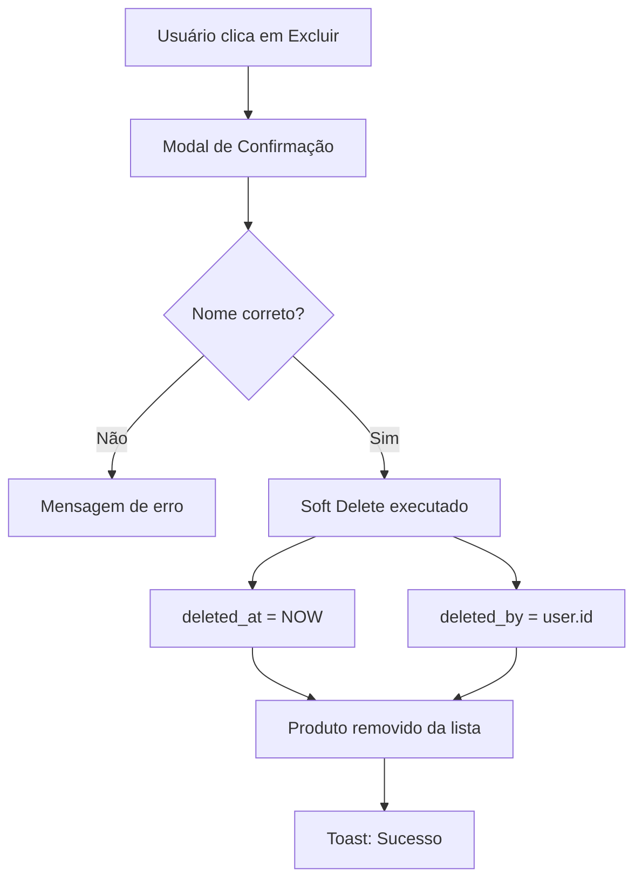
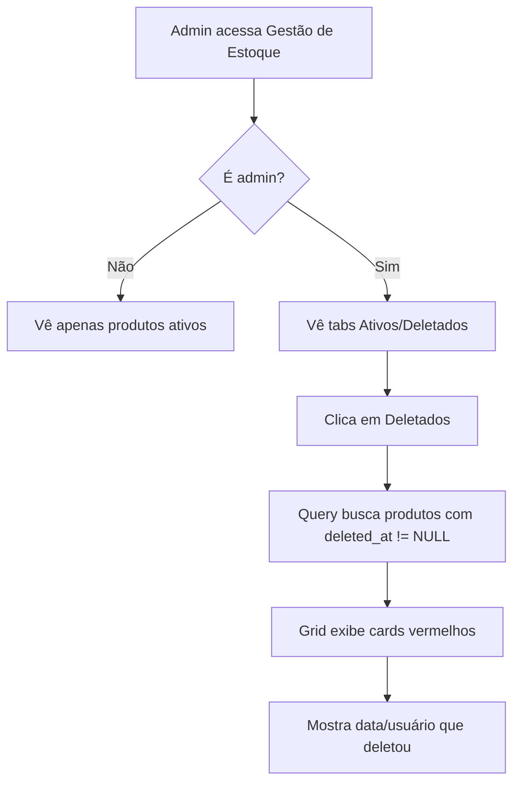
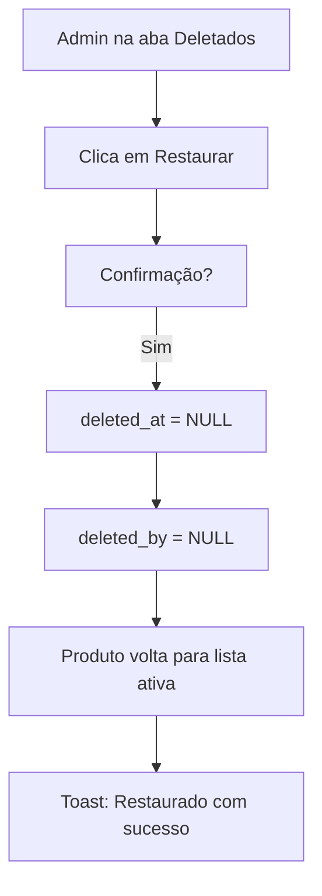

# 🗑️ Sistema de Soft Delete de Produtos

> **Versão**: 3.3.4
> **Status**: ✅ Production Ready
> **Última Atualização**: 24 de outubro de 2025

---

## 📋 Visão Geral

O Sistema de Soft Delete de Produtos é uma funcionalidade **enterprise-grade** que permite a exclusão segura de produtos com capacidade de **auditoria completa** e **restauração**. Este sistema preserva o histórico de vendas e movimentações, garantindo integridade de relatórios e conformidade com requisitos de auditoria.

### 🎯 Objetivos

1. **Segurança**: Evitar perda acidental de dados
2. **Auditoria**: Rastrear quem deletou e quando
3. **Recuperação**: Restaurar produtos deletados quando necessário
4. **Integridade**: Manter histórico de vendas e relatórios funcionando
5. **Conformidade**: Atender requisitos de compliance e auditoria

---

## 🏗️ Arquitetura

### Estrutura do Banco de Dados

**Colunas Adicionadas à Tabela `products`:**

```sql
-- Timestamp de exclusão (NULL = ativo, NOT NULL = deletado)
deleted_at TIMESTAMPTZ

-- UUID do usuário que deletou (rastreamento de auditoria)
deleted_by UUID REFERENCES auth.users(id)
```

**Índice para Performance:**
```sql
CREATE INDEX idx_products_deleted_at
  ON products(deleted_at)
  WHERE deleted_at IS NULL;
```

### Políticas RLS (Row Level Security)

**Policy 1: Produtos Ativos (Todos os usuários)**
```sql
CREATE POLICY "Enable read access for active products"
  ON products FOR SELECT
  USING (deleted_at IS NULL);
```

**Policy 2: Produtos Deletados (Admin apenas)**
```sql
CREATE POLICY "Enable read access for deleted products (admin only)"
  ON products FOR SELECT
  USING (
    deleted_at IS NOT NULL
    AND auth.uid() IN (
      SELECT id FROM profiles WHERE role = 'admin'
    )
  );
```

---

## 📦 Componentes

### 1. Hook: `useProductDelete`

**Localização**: `src/features/inventory/hooks/useProductDelete.ts`

**Interface**:
```typescript
export interface UseProductDeleteReturn {
  softDelete: (productId: string) => Promise<void>;
  restore: (productId: string) => Promise<void>;
  getProductInfo: (productId: string) => Promise<ProductDeleteInfo | null>;
  isDeleting: boolean;
  isRestoring: boolean;
}
```

**Uso**:
```typescript
const { softDelete, restore, getProductInfo, isDeleting, isRestoring } = useProductDelete();

// Deletar produto
await softDelete('product-uuid');

// Restaurar produto
await restore('product-uuid');

// Obter informações antes de deletar
const info = await getProductInfo('product-uuid');
console.log(`Produto tem ${info.salesCount} vendas`);
```

**Funcionalidades**:
- ✅ Soft delete com timestamp
- ✅ Rastreamento de quem deletou
- ✅ Restauração com limpeza de audit trail
- ✅ Busca de informações (vendas, movimentos)
- ✅ Cache invalidation automática
- ✅ Toast notifications

---

### 2. Hook: `useDeletedProducts`

**Localização**: `src/features/inventory/hooks/useDeletedProducts.ts`

**Uso**:
```typescript
const { data: deletedProducts, isLoading } = useDeletedProducts();

// deletedProducts contém array de produtos deletados
deletedProducts.forEach(product => {
  console.log(`${product.name} deletado em ${product.deleted_at}`);
});
```

**Características**:
- ✅ Query otimizada via React Query
- ✅ Ordenação por data de exclusão (mais recente primeiro)
- ✅ Cache automático
- ✅ Type-safe com TypeScript

---

### 3. Modal: `DeleteProductModal`

**Localização**: `src/features/inventory/components/DeleteProductModal.tsx`

**Props**:
```typescript
interface DeleteProductModalProps {
  isOpen: boolean;
  onClose: () => void;
  productId: string | null;
  productName: string;
  onSuccess?: () => void;
}
```

**Características**:
- ✅ Confirmação por digitação do nome do produto (case-sensitive)
- ✅ Exibição de informações críticas:
  - Nome e categoria
  - Código de barras
  - Estoque atual (pacotes + unidades)
  - Histórico de vendas
  - Histórico de movimentações
- ✅ Alertas visuais para produtos com histórico
- ✅ Estados de loading e erro
- ✅ Validação em tempo real

**Exemplo de Uso**:
```tsx
<DeleteProductModal
  isOpen={isDeleteModalOpen}
  onClose={() => setIsDeleteModalOpen(false)}
  productId={product.id}
  productName={product.name}
  onSuccess={() => {
    // Refresh lista de produtos
    queryClient.invalidateQueries(['products']);
  }}
/>
```

---

### 4. Componente: `DeletedProductCard`

**Localização**: `src/features/inventory/components/DeletedProductCard.tsx`

**Visual**:
- 🔴 Tema vermelho indicando estado deletado
- 📛 Badge "DELETADO" destacado
- 📅 Data e hora da exclusão formatada
- 👤 Nome do usuário que deletou
- 🔄 Botão de restauração

**Props**:
```typescript
interface DeletedProductCardProps {
  product: DeletedProduct;
  onRestore: (product: DeletedProduct) => void;
  isRestoring: boolean;
}
```

---

### 5. Grid: `DeletedProductsGrid`

**Localização**: `src/features/inventory/components/DeletedProductsGrid.tsx`

**Funcionalidades**:
- ✅ Grid responsivo (1 coluna mobile, 3 colunas desktop)
- ✅ Loading state com spinner
- ✅ Empty state quando não há produtos deletados
- ✅ Animação stagger (delay progressivo nos cards)

---

### 6. Interface Admin: Tabs de Gerenciamento

**Localização**: `src/features/inventory/components/InventoryManagement.tsx`

**Funcionalidades**:
- ✅ Tabs "Produtos Ativos" e "Produtos Deletados"
- ✅ Visibilidade apenas para admins
- ✅ Contadores em badges (ex: 527 ativos, 3 deletados)
- ✅ Ícones distintos por categoria
- ✅ Renderização condicional baseada em `viewMode`

**Verificação de Admin**:
```typescript
const { userRole, loading } = useAuth();
const isAdmin = !loading && userRole === 'admin';

{isAdmin && (
  <TabsContainer>
    <ActiveProductsTab />
    <DeletedProductsTab />
  </TabsContainer>
)}
```

---

## 🔄 Fluxos de Trabalho

### Fluxo 1: Exclusão de Produto (Usuário)



### Fluxo 2: Visualização de Deletados (Admin)



### Fluxo 3: Restauração (Admin)



---

## 🔐 Segurança e Permissões

### Matriz de Permissões

| Ação | Usuário | Employee | Admin |
|------|---------|----------|-------|
| **Ver produtos ativos** | ✅ | ✅ | ✅ |
| **Deletar produto** | ❌ | ✅ | ✅ |
| **Ver produtos deletados** | ❌ | ❌ | ✅ |
| **Restaurar produto** | ❌ | ❌ | ✅ |

### Auditoria

Toda exclusão e restauração é rastreada:

**Campos de Auditoria**:
- `deleted_at`: Timestamp exato da exclusão
- `deleted_by`: UUID do usuário que deletou

**Logs Automáticos**:
```typescript
// Ao deletar
console.log(`Produto ${productId} deletado por ${userId} em ${timestamp}`);

// Ao restaurar
console.log(`Produto ${productId} restaurado em ${timestamp}`);
```

---

## 📊 Queries e Performance

### Query de Produtos Ativos

```typescript
const { data: products } = useQuery({
  queryKey: ['products'],
  queryFn: async () => {
    const { data, error } = await supabase
      .from('products')
      .select('*')
      .is('deleted_at', null)  // Filtro essencial
      .order('name', { ascending: true });

    return data;
  }
});
```

**Performance**:
- ✅ Índice `idx_products_deleted_at` otimiza WHERE deleted_at IS NULL
- ✅ Partial index (apenas produtos ativos) reduz tamanho do índice
- ✅ Query plan usa index scan em vez de sequential scan

### Query de Produtos Deletados (Admin)

```typescript
const { data: deletedProducts } = useQuery({
  queryKey: ['products', 'deleted'],
  queryFn: async () => {
    const { data, error } = await supabase
      .from('products')
      .select('*')
      .not('deleted_at', 'is', null)  // Produtos deletados
      .order('deleted_at', { ascending: false });  // Mais recente primeiro

    return data;
  }
});
```

---

## 🎯 Boas Práticas

### 1. Sempre Usar Soft Delete

```typescript
// ❌ NUNCA fazer hard delete
await supabase.from('products').delete().eq('id', productId);

// ✅ SEMPRE usar soft delete
await softDelete(productId);
```

### 2. Invalidar Cache Corretamente

```typescript
// Após deletar ou restaurar
queryClient.invalidateQueries({ queryKey: ['products'] });
queryClient.invalidateQueries({ queryKey: ['products', 'deleted'] });
```

### 3. Confirmação Obrigatória

```typescript
// ✅ Modal de confirmação com digitação do nome
<DeleteProductModal
  productName={product.name}
  onConfirm={() => softDelete(product.id)}
/>

// ❌ Deletar sem confirmação
<Button onClick={() => softDelete(product.id)}>Excluir</Button>
```

### 4. Verificar Histórico

```typescript
// Antes de deletar, mostrar impacto
const info = await getProductInfo(productId);

if (info.salesCount > 0) {
  showWarning(`Este produto tem ${info.salesCount} vendas registradas`);
}
```

---

## 🛠️ Troubleshooting

### Problema: Produtos não aparecem na lista

**Causa**: Filtro `deleted_at IS NULL` aplicado mas coluna não existe no banco

**Solução**:
```sql
-- Verificar se colunas existem
SELECT column_name
FROM information_schema.columns
WHERE table_name = 'products'
  AND column_name IN ('deleted_at', 'deleted_by');

-- Se não existirem, aplicar migração
-- supabase/migrations/20251024143850_add_products_soft_delete.sql
```

### Problema: Erro 400 ao buscar produtos

**Sintoma**: `Failed to load resource: the server responded with a status of 400`

**Causa**: Query tentando filtrar por coluna inexistente

**Solução**: Aplicar migração SQL em produção

### Problema: Admin não vê aba de deletados

**Causa 1**: Bug no AuthContext (profile vs userRole)
```typescript
// ❌ Errado
const { profile } = useAuth();
const isAdmin = profile?.role === 'admin';

// ✅ Correto
const { userRole, loading } = useAuth();
const isAdmin = !loading && userRole === 'admin';
```

**Causa 2**: Role no banco diferente de 'admin'
```sql
-- Verificar role do usuário
SELECT id, email, role FROM profiles WHERE id = auth.uid();
```

---

## 📝 Checklist de Implementação

Ao implementar soft delete em outras entidades, siga este checklist:

### Banco de Dados
- [ ] Adicionar colunas `deleted_at` e `deleted_by`
- [ ] Criar índice parcial para performance
- [ ] Criar RLS policies para produtos ativos
- [ ] Criar RLS policies para produtos deletados (admin)
- [ ] Testar queries com e sem filtro

### Backend/Hooks
- [ ] Criar hook `useSoftDelete` (delete + restore + getInfo)
- [ ] Criar hook `useDeletedItems` para query
- [ ] Implementar cache invalidation
- [ ] Adicionar toast notifications
- [ ] Tratamento de erros

### Frontend/UI
- [ ] Modal de confirmação com validação
- [ ] Exibição de informações críticas
- [ ] Card/Lista para items deletados
- [ ] Botão de restauração
- [ ] Loading states e feedback visual

### Segurança
- [ ] Verificar permissões (apenas admin vê deletados)
- [ ] Auditoria (rastrear quem deletou)
- [ ] Validação de role no frontend e backend

### Testes
- [ ] Testar exclusão
- [ ] Testar visualização de deletados
- [ ] Testar restauração
- [ ] Testar permissões (admin vs usuário)
- [ ] Testar edge cases (produto com vendas, etc.)

---

## 📚 Referências

### Documentação Relacionada
- [Changelog v3.3.4](../../07-changelog/PRODUCT_DELETE_MODAL_FIXES_v3.3.4.md) - Implementação completa
- [Soft Delete Pattern](https://martinfowler.com/eaaCatalog/tombstone.html) - Padrão de arquitetura
- [Supabase RLS](https://supabase.com/docs/guides/auth/row-level-security) - Documentação oficial

### Arquivos do Sistema
```
src/features/inventory/
├── hooks/
│   ├── useProductDelete.ts          # Hook principal de delete/restore
│   └── useDeletedProducts.ts        # Hook para query de deletados
├── components/
│   ├── DeleteProductModal.tsx       # Modal de confirmação
│   ├── DeletedProductCard.tsx       # Card individual
│   ├── DeletedProductsGrid.tsx      # Grid de deletados
│   └── InventoryManagement.tsx      # Interface principal com tabs

supabase/migrations/
└── 20251024143850_add_products_soft_delete.sql  # Migração SQL
```

---

## 🚀 Próximos Passos

### Melhorias Futuras

1. **Filtros Avançados**
   - Filtrar por categoria
   - Filtrar por período de exclusão
   - Filtrar por usuário que deletou

2. **Exportação**
   - Exportar lista de deletados em CSV
   - Relatório de auditoria de exclusões

3. **Automação**
   - Auto-exclusão permanente após X dias
   - Notificação por email ao deletar
   - Backup automático antes de exclusão

4. **Dashboard**
   - Métricas de produtos deletados
   - Timeline de exclusões
   - Produtos mais restaurados

---

## 👥 Autoria

**Desenvolvido por**: Equipe Adega Manager
**Versão**: 3.3.4
**Data**: 24 de outubro de 2025
**Status**: ✅ Production Ready

---

**Última Atualização**: 24/10/2025
