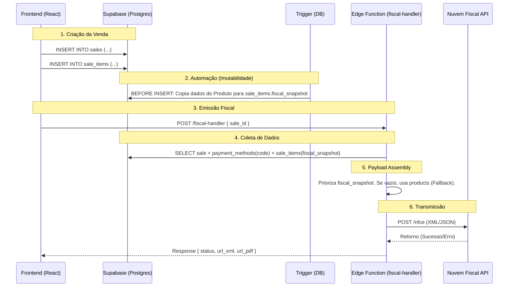

# 02. Fiscal Architecture & Flow

Este documento descreve como a emissão de notas fiscais (NFC-e) trafega desde o
clique no Frontend até a API da Nuvem Fiscal.

## 1. High-Level Flow (Fluxo)

---

## 2. Priority Logic (Lógica de Prioridade)

O Edge Function (`fiscal-handler`) usa uma lógica defensiva para montar o
payload fiscal, garantindo que sempre haja dados válidos, mas respeitando o
histórico.

### A. Para Dados do Item (NCM, CFOP, Nome)

1. **Prioridade 1:** `sale_items.fiscal_snapshot`
   - Este é o dado "congelado" no momento da venda. Se o NCM do produto mudou no
     cadastro depois da venda, o snapshot mantém o valor original (correto para
     aquela data).
2. **Prioridade 2 (Fallback):** `products` table
   - Usado **apenas** se o snapshot estiver vazio (ex: vendas legadas de 2024
     sem backfill).
3. **Default:** Valores padrão de segurança (NCM `00000000`, CFOP `5102`).

### B. Para Método de Pagamento (`tPag`)

1. **Prioridade 1:** `payment_methods.code`
   - Valor vindo do JOIN SQL (ex: "01", "17").
2. **Fallback:** `'99'` (Outros)
   - Usado se o relacionamento estiver quebrado ou nulo.

---

## 3. Prevenção de Erros (Validations)

O sistema conta com camadas de defesa para evitar rejeições da SEFAZ (Erro 225,
391, etc).

| Camada            | Mecanismo                 | O que previne?                                                                   |
| :---------------- | :------------------------ | :------------------------------------------------------------------------------- |
| **Database**      | `CHECK (ncm ~ '^\d{8}$')` | Previne NCMs com letras, espaços ou menos de 8 dígitos.                          |
| **Database**      | `CHECK (ucom IN (...))`   | Previne unidades inválidas ("un", "Litro", etc). Apenas "UN", "L", "KG" aceitos. |
| **Trigger**       | `trg_set_fiscal_snapshot` | Previne itens sem dados fiscais. Mesmo que o frontend "esqueça", o banco lembra. |
| **Edge Function** | Default `tPag='99'`       | Previne envio de nota sem método de pagamento definido.                          |

---

## 4. Endpoints

- **Produção:** `https://[project-ref].supabase.co/functions/v1/fiscal-handler`
- **Payload esperado:** `{ "saleId": "uuid-da-venda" }`
- **Autenticação:** Bearer Token (JWT do usuário logado).

---

## 5. Fiscal Address & Customer Data

Para que a NFC-e seja emitida com identificação do destinatário (CPF/CNPJ e
Endereço), o sistema impõe padrões rígidos no cadastro de clientes.

### Estrutura `FiscalAddress` (JSONB)

O endereço no banco (`customers.address`) deve conter o **Código IBGE
(`codigo_municipio`)**. Sem isso, a SEFAZ rejeita notas interestaduais ou com
delivery.

### Estratégia de Lookup (Client-Side)

No Frontend (`CustomerForm`), utilizamos uma estratégia de **Redundância** para
garantir o preenchimento automático e correto:

1. **ViaCEP (Primary):** Prioritário por estabilidade e CORS-friendly.
2. **BrasilAPI (Fallback):** Secundário caso ViaCEP falhe.

Isso elimina erros de "Dados do Transportador/Destinatário Incompletos".
