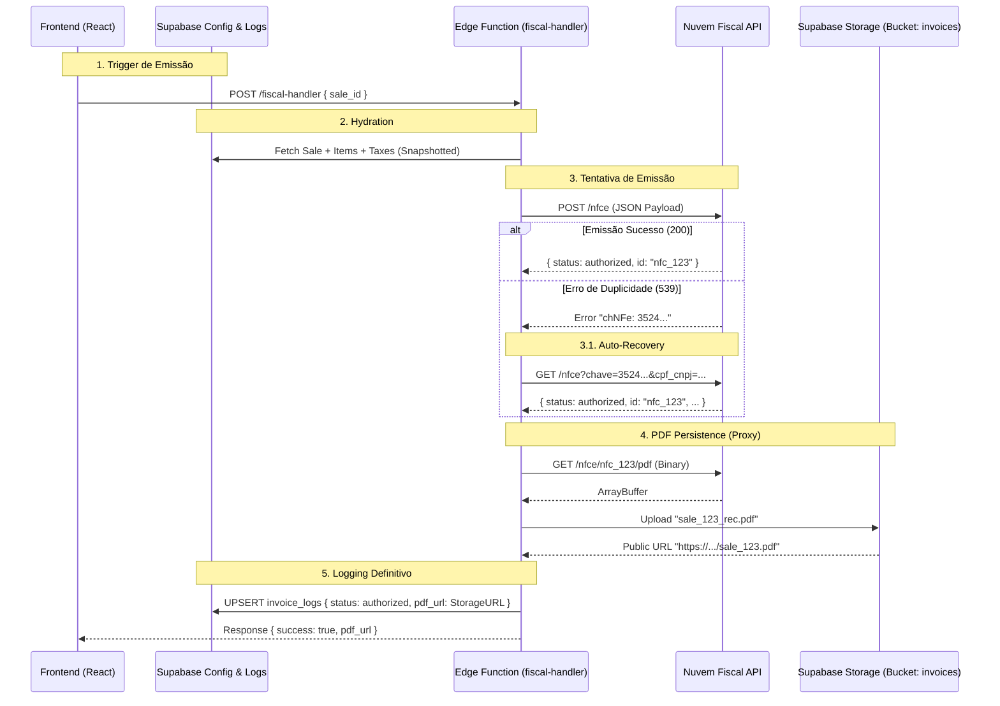

# 02. Fiscal Architecture & Flow (NFC-e)

Este documento descreve o motor fiscal do ERP AdegaManager. Ele detalha como o
sistema garante a emissão, contingência e armazenamento de Notas Fiscais de
Consumidor Eletrônica (NFC-e).

## 1. High-Level Flow (Fluxo Completo)

O sistema implementa um padrao **"Proxy with Storage"** para garantir que nenhum
link fiscal seja perdido.

---

## 2. Tax Logic & Regimes (Regras Tributárias)

O sistema foi configurado especificamente para **MEI (Microempreendedor
Individual)**, mas suporta expansão.

### Regime: Simples Nacional (MEI) - CRT 4

Para evitar rejeições da SEFAZ e simplificar o cálculo:

- **CRT (Código de Regime Tributário):** `4` (Simples Nacional - MEI).
- **CSOSN:** `102` (Tributada pelo Simples Nacional sem permissão de crédito).
- **ICMS:** `0.00` (Zerado). O MEI paga imposto fixo mensal (DAS), não por item.
  As tags `vBC` e `vICMS` são enviadas como zero.

---

## 3. Resilience Mechanisms (Mecanismos de Resiliência)

O módulo fiscal segue o princípio de **"Anti-Fragilidade"**.

### A. Auto-Recovery de Duplicidade

**Cenário:** O usuário clica em "Emitir", a API processa, mas a conexão cai
antes da resposta. O usuário clica de novo. **Comportamento Padrão:** A API
retornaria erro `539 Duplicidade` e o usuário ficaria sem o PDF. **Comportamento
ERP:**

1. O sistema detecta o erro `539`.
2. Extrai a Chave de Acesso (`chNFe`) da mensagem de erro via Regex.
3. Faz uma busca ativa na API (`GET /nfce`) usando a chave, o CNPJ e o ambiente.
4. Recupera os dados da nota "perdida" e prossegue para o fluxo de download do
   PDF como se fosse uma nova emissão.

### B. Storage Proxy

**Problema:** A Nuvem Fiscal não retorna uma URL pública permanente para o PDF
na emissão assíncrona, ou o link expira. **Solução:** O `fiscal-handler` atua
como um Proxy de Arquivo.

1. Baixa o binário (`ArrayBuffer`) da API oficial.
2. Faz upload para o Bucket `invoices` do Supabase.
3. Garante que o link salvo no banco (`invoice_logs.pdf_url`) seja do nosso
   domínio, sob nosso controle.

---

## 4. Estrutura de Log (`invoice_logs`)

Esta tabela é a "Caixa Preta" do sistema fiscal.

| Coluna          | Descrição                                                                      |
| :-------------- | :----------------------------------------------------------------------------- |
| `sale_id`       | FK para a Venda.                                                               |
| `status`        | `authorized`, `rejected`, `processing`.                                        |
| `external_id`   | ID da nota na Nuvem Fiscal (`nfc_...`).                                        |
| `pdf_url`       | **URL Pública do Supabase Storage** (Definitivo).                              |
| `xml_url`       | URL do XML (geralmente link externo ou nulo).                                  |
| `payload`       | JSON completo enviado para a API (para debug).                                 |
| `error_message` | Em caso de falha, contém o stack trace ou dumps de debug (`[DEBUG RECOVERY]`). |

---

## 5. Checklist de Manutenção

- **Mudança de CNPJ:** Requer atualizar `store_settings` e re-autenticar na
  Nuvem Fiscal.
- **Ambiente:** Controlado por `store_settings.environment` ('production' ou
  'development').
- **Token:** O sistema usa _Client Credentials Flow_. As chaves ficam em
  `SUPABASE_SECRETS`.
